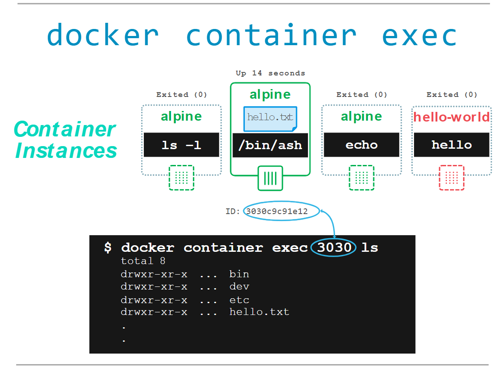

# Your First Linux Containers 
En este laboratorio, explorará los conceptos básicos de la ejecución de contenedores: extraer imágenes de un registro, ejecutar una aplicación en contenedores e instancias y aislamiento de contenedores.

Conceptos en este ejercicio:

 - Motor Docker

 - Contenedores e imágenes

 - Registros de imágenes y Docker Hub

 - Aislamiento de contenedores


#### 1.0 Running your first container

¡Es hora de ponerse manos a la obra! Como ocurre con todas las cuestiones técnicas, una aplicación de tipo "Hola mundo" es un buen punto de partida. Escriba o haga clic en el código que aparece a continuación para ejecutar su primer contenedor Docker:

```
docker container run hello-world
```


Eso es todo: tu primer contenedor. La salida del contenedor hello-world te cuenta un poco sobre lo que acaba de pasar. Básicamente, el motor Docker que se ejecuta en tu terminal intentó encontrar una imagen llamada hello-world. Dado que recién comenzaste, no hay imágenes almacenadas localmente ( Unable to find image...), por lo que el motor Docker va a su registro Docker predeterminado , que es Docker Hub , para buscar una imagen llamada "hello-world". Encuentra la imagen allí, la descarga y luego la ejecuta en un contenedor. Y la única función de hello-world es generar el texto que ves en tu terminal, después de lo cual el contenedor sale.


#### 1.1 Docker Images

En el resto de este laboratorio, ejecutará un contenedor Alpine Linux . Alpine es una distribución Linux liviana, por lo que es rápida de instalar y ejecutar, lo que la convierte en un punto de partida popular para muchas otras imágenes.

Para comenzar, ejecutemos lo siguiente en nuestra terminal:

```docker image pull alpine```


El pullcomando obtiene la imagen alpina del registro de Docker y la guarda en nuestro sistema. En este caso, el registro es Docker Hub . Puedes cambiar el registro, pero ese es un laboratorio diferente.

Puede utilizar el docker imagecomando para ver una lista de todas las imágenes en su sistema.
```docker image ls```


#### 1.1 Docker Container Run

¡Genial! Ahora ejecutemos un contenedor Docker basado en esta imagen. Para ello, utilizaremos el docker container runcomando.

```docker container run alpine ls -l```

Si bien el resultado del lscomando puede no ser tan emocionante, detrás de escena sucedieron bastantes cosas. Cuando llama run, el cliente Docker encuentra la imagen (alpina en este caso), crea el contenedor y luego ejecuta un comando en ese contenedor. Cuando ejecutaste docker container run alpine, proporcionaste un comando ( ls -l), por lo que Docker ejecutó este comando dentro del contenedor para el cual viste la lista de directorios. Una vez finalizado el lscomando, el contenedor se cerró.


Cuando ejecutas docker container run alpine ls -l, Docker crea y ejecuta un contenedor a partir de la imagen de Alpine, ejecutando el comando ls -l dentro del contenedor. El contenedor se detiene una vez que el comando ha terminado. De manera similar, el comando docker container run alpine echo "hello from alpine" ejecuta un contenedor de Alpine que imprime "hello from alpine". Si quieres acceder a una shell interactiva dentro del contenedor, puedes usar docker container run alpine /bin/sh.


El hecho de que el contenedor haya salido después de ejecutar nuestro comando es importante, como comenzarás a ver. Probemos algo más interesante. Escribe lo siguiente:

```docker container run alpine echo "hello from alpine"```


```docker container run alpine /bin/sh```


```docker container ls```


#### 1.2 Container Isolation

En los pasos anteriores, ejecutamos varios comandos a través de instancias de contenedor con la ayuda de docker container run. El docker container ls -acomando nos mostró que había varios contenedores enumerados. ¿Por qué hay tantos contenedores enumerados si todos son de la imagen alpina ?

Este es un concepto de seguridad fundamental en el mundo de los contenedores Docker. Aunque cada docker container runcomando utilizaba la misma imagen alpina , cada ejecución era un contenedor separado y aislado . Cada contenedor tiene un sistema de archivos independiente y se ejecuta en un espacio de nombres diferente; de ​​manera predeterminada, un contenedor no tiene forma de interactuar con otros contenedores, incluso con aquellos de la misma imagen. Probemos con otro ejercicio para aprender más sobre el aislamiento.


```docker container run -it alpine /bin/ash```

Hay /bin/ashotro tipo de shell disponible en la imagen alpina. Una vez que se inicia el contenedor y se encuentra en el símbolo del sistema del contenedor, escriba los siguientes comandos:


```docker container run alpine ls```


```docker container ls -a```


Gráficamente esto es lo que sucedió en nuestro Docker Engine:


El contenedor en el que creamos el archivo “hello.txt” es el mismo en el que usamos el /bin/ashshell, que podemos ver en la columna “COMMAND”. El número de ID de contenedor de la primera columna identifica de forma única esa instancia de contenedor en particular. En el ejemplo de salida anterior, el ID de contenedor es 3030c9c91e12. Podemos usar un comando ligeramente diferente para indicarle a Docker que ejecute esta instancia de contenedor específica. Intente escribir:

```docker container start <container ID>```


Observe que esta vez nuestra instancia de contenedor aún se está ejecutando. Usamos el shell ash esta vez, por lo que en lugar de simplemente salir como lo hizo /bin/sh anteriormente, ash espera un comando. Podemos enviar un comando al contenedor para que se ejecute usando el execcomando, de la siguiente manera:

```docker container exec <container ID> ls```

Esta vez obtenemos una lista de directorios y muestra nuestro archivo “hello.txt” porque usamos la instancia de contenedor donde creamos ese archivo.




#### 1.3 Terminología
En la última sección, viste mucha jerga específica de Docker que puede resultar confusa para algunos. Por eso, antes de continuar, aclaremos algunos términos que se usan con frecuencia en el ecosistema de Docker.

- **Imágenes :** el sistema de archivos y la configuración de nuestra aplicación que se utilizan para crear contenedores. Para obtener más información sobre una imagen de Docker, ejecute docker image inspect alpine. En la demostración anterior, utilizó el docker image pullcomando para descargar la imagen alpina . Cuando ejecutó el comando docker container run hello-world, también realizó un docker image pullbackstage para descargar la imagen de hello-world .
- **Contenedores :** instancias en ejecución de imágenes de Docker: los contenedores ejecutan las aplicaciones reales. Un contenedor incluye una aplicación y todas sus dependencias. Comparte el núcleo con otros contenedores y se ejecuta como un proceso aislado en el espacio de usuario en el sistema operativo host. Creaste un contenedor con docker runla imagen de Alpine que descargaste. Puedes ver una lista de contenedores en ejecución con el docker container lscomando.
- **Demonio Docker :** el servicio en segundo plano que se ejecuta en el host y que administra la creación, ejecución y distribución de contenedores Docker.
- **Cliente Docker :** la herramienta de línea de comandos que permite al usuario interactuar con el demonio Docker.
Docker Hub - Store es, entre otras cosas, un registro de imágenes de Docker. Puedes pensar en el registro como un directorio de todas las imágenes de Docker disponibles. Lo usarás más adelante en este tutorial.


