# Doing More With Docker Images

En el ejercicio anterior, extrajiste imágenes de Docker Store para ejecutarlas en tus contenedores. Luego, ejecutaste varias instancias y notaste cómo cada instancia estaba aislada de las demás. Dijimos que esto se usa en muchos entornos de TI de producción todos los días, pero obviamente necesitamos algunas herramientas más para llegar al punto en que Docker pueda convertirse en un verdadero ahorro de tiempo y dinero.

Lo primero que puede que quieras hacer es averiguar cómo crear tus propias imágenes. Si bien hay más de 700 000 imágenes en Docker Store , es casi seguro que ninguna de ellas es exactamente lo que ejecutas en tu centro de datos hoy en día. Incluso algo tan común como una imagen del sistema operativo Windows necesitaría sus propios ajustes antes de ejecutarlo realmente en producción. En el primer laboratorio , creamos un archivo llamado "hello.txt" en una de nuestras instancias de contenedor. Si esa instancia de nuestro contenedor Alpine era algo que quisiéramos reutilizar en contenedores futuros y compartir con otros, necesitaríamos crear una imagen personalizada que todos pudieran usar.

Comenzaremos con la forma más sencilla de creación de imágenes, en la que simplemente creamos commituna de nuestras instancias de contenedor como imagen. Luego exploraremos un método mucho más poderoso y útil para crear imágenes: el Dockerfile.

Luego veremos cómo obtener los detalles de una imagen a través de la inspección y exploraremos el sistema de archivos para tener una mejor comprensión de lo que sucede bajo el capó.


#### Image creation from a container
Comencemos ejecutando un shell interactivo en un contenedor de Ubuntu:

```docker container run -ti ubuntu bash```
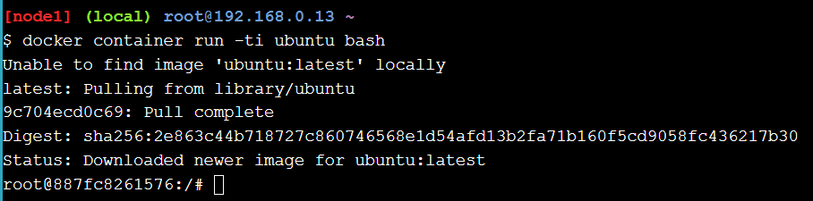

Como ya sabes de los laboratorios anteriores, simplemente tomaste la imagen llamada “ubuntu” de Docker Store y ahora estás ejecutando el shell bash dentro de ese contenedor. 

Para personalizar un poco las cosas, instalaremos un paquete llamado figlet en este contenedor. El contenedor debería seguir ejecutándose, así que escriba los siguientes comandos en la línea de comandos del contenedor de Ubuntu:

```
apt-get update
apt-get install -y figlet
figlet "hello docker"
```

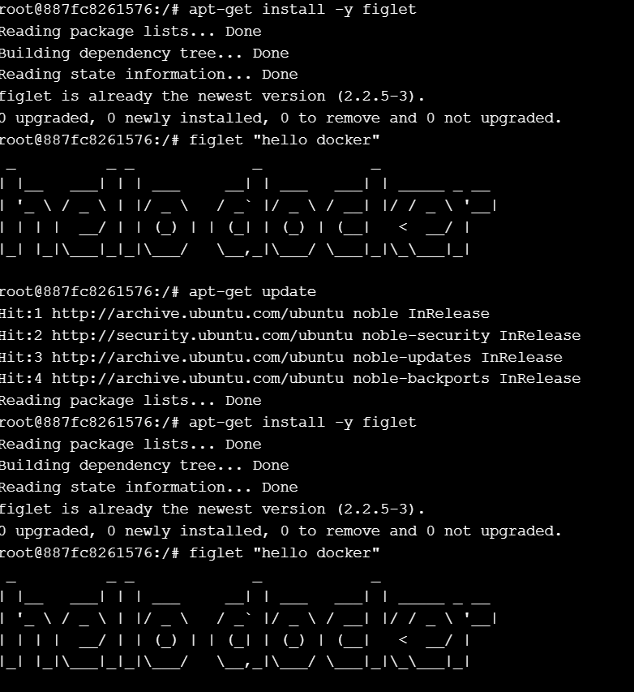

Deberías ver las palabras "hola docker" impresas en caracteres ASCII grandes en la pantalla. Continúa y sal de este contenedor.

```exit```

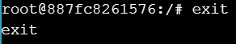

Ahora imaginemos que esta nueva aplicación Figlet es bastante útil y que quieres compartirla con el resto de tu equipo. Podrías decirles que hagan exactamente lo que hiciste anteriormente e instalen Figlet en su propio contenedor, lo cual es bastante simple en este ejemplo. Pero si se trata de una aplicación del mundo real en la que acabas de instalar varios paquetes y ejecutar una serie de pasos de configuración, el proceso podría volverse engorroso y propenso a errores. En cambio, sería más fácil crear una imagen que puedas compartir con tu equipo.

Para comenzar, necesitamos obtener el ID de este contenedor usando el comando ls (no olvide la opción -a ya que el comando ls no devuelve los contenedores que no están en ejecución).

```docker container ls -a```

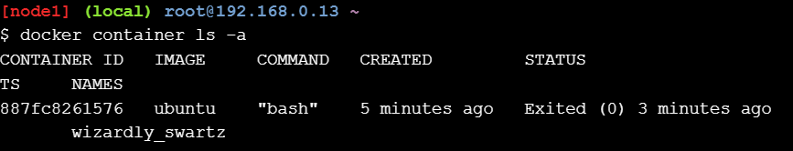

Antes de crear nuestra propia imagen, es posible que queramos inspeccionar todos los cambios que hemos realizado. Prueba a escribir el comando docker container diff <container ID>para el contenedor que acabas de crear. Deberías ver una lista de todos los archivos que se agregaron o cambiaron en el contenedor cuando instalaste figlet. Docker realiza un seguimiento de toda esta información para nosotros. Esto es parte del concepto de capa que exploraremos en unos minutos.

Ahora, para crear una imagen, necesitamos "confirmar" este contenedor. La confirmación crea una imagen localmente en el sistema que ejecuta el motor Docker. Ejecute el siguiente comando, utilizando el ID del contenedor que recuperó, para confirmar el contenedor y crear una imagen a partir de él.


```docker container commit CONTAINER_ID```

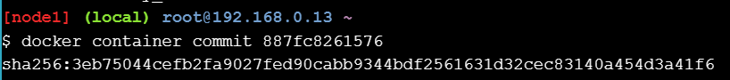

¡Eso es todo! ¡Has creado tu primera imagen! Una vez que la hayas enviado, podremos ver la imagen recién creada en la lista de imágenes disponibles.

```docker image ls```

Debería ver algo como esto:

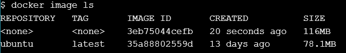

Tenga en cuenta que la imagen que extrajimos en el primer paso (ubuntu) aparece aquí junto con nuestra propia imagen personalizada. Excepto que nuestra imagen personalizada no tiene información en las columnas REPOSITORIO o ETIQUETA, lo que dificultaría identificar exactamente qué había en este contenedor si quisiéramos compartirlo entre varios miembros del equipo.

Agregar esta información a una imagen se conoce como etiquetar una imagen. A partir del comando anterior, obtenga el ID de la imagen recién creada y etiquétela para que se llame ourfiglet :

```docker image tag <IMAGE_ID> ourfiglet```

```docker image ls```
Ahora tenemos el nombre más amigable “ourfiglet” que podemos usar para identificar nuestra imagen.

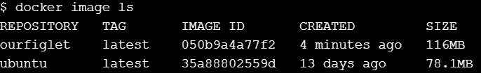

Aquí hay una vista gráfica de lo que acabamos de completar:

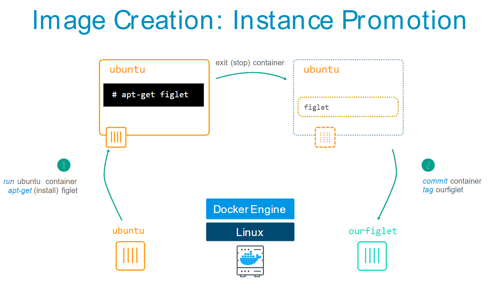

Ahora ejecutaremos un contenedor basado en la imagen ourfiglet recién creada :

```docker container run ourfiglet figlet hello```

Como el paquete figlet está presente en nuestra imagen ourfiglet , el comando devuelve el siguiente resultado:

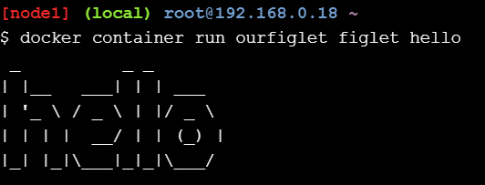
#### Image creation using a Dockerfile

Escriba el siguiente contenido en un archivo llamado index.js . Puede utilizar vi, vim o varios otros editores de Linux en este ejercicio. Si necesita ayuda con los comandos del editor de Linux para realizar esta tarea, siga esta nota al pie 2 .

```
var os = require("os");
var hostname = os.hostname();
console.log("hello from " + hostname);
```
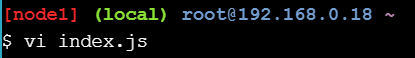

El archivo que acabamos de crear es el código javascript para nuestro servidor. Como probablemente puedas adivinar, Node.js simplemente imprimirá un mensaje de "hola". Incorporaremos esta aplicación a Docker creando un Dockerfile. Usaremos alpine como la imagen base del sistema operativo, agregaremos un entorno de ejecución de Node.js y luego copiaremos nuestro código fuente en el contenedor. También especificaremos el comando predeterminado que se ejecutará al crear el contenedor.

Cree un archivo llamado Dockerfile y copie el siguiente contenido en él. Nuevamente, aquí encontrará ayuda para crear este archivo con editores de Linux.

```
FROM alpine
RUN apk update && apk add nodejs
COPY . /app
WORKDIR /app
CMD ["node","index.js"]
```
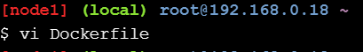
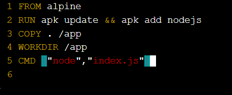

Construyamos nuestra primera imagen a partir de este Dockerfile y llamémosla hello:v0.1 :

```docker image build -t hello:v0.1 .```

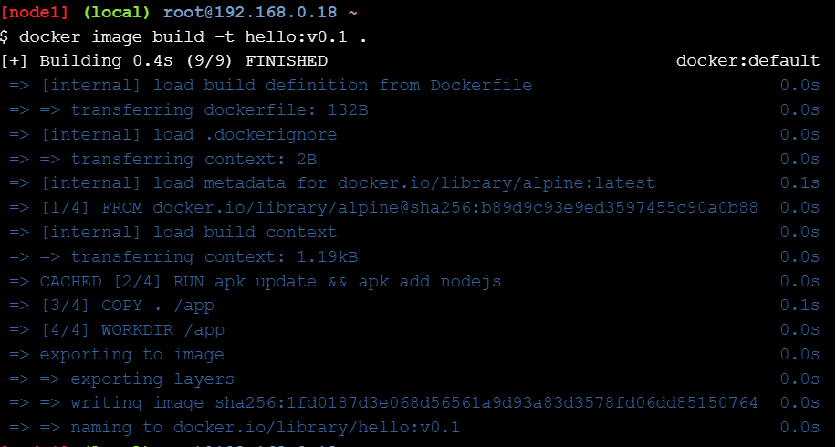

Esto es lo que acabas de completar:

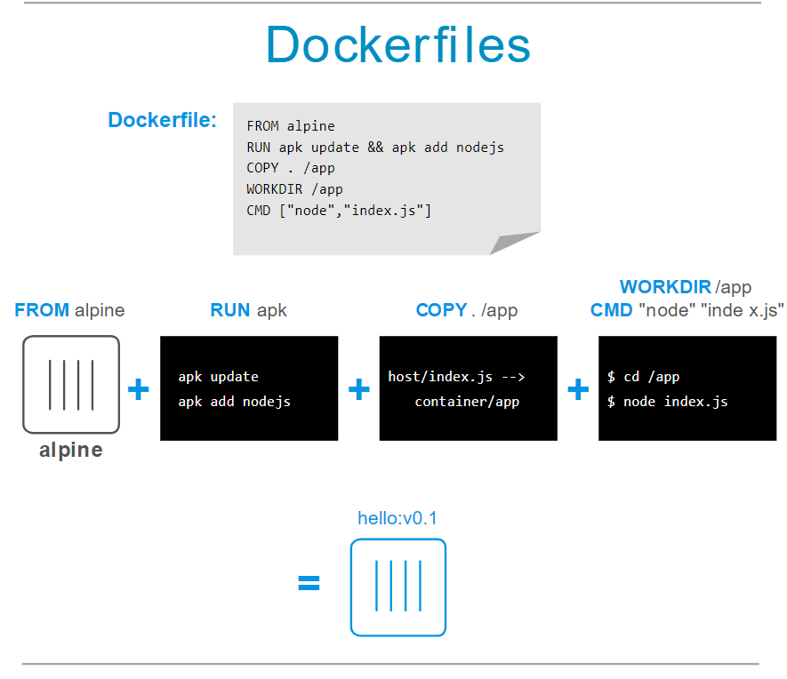

Luego iniciamos un contenedor para verificar que nuestras aplicaciones se ejecutan correctamente:

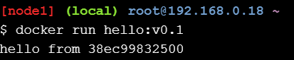


#### Image layers
Hay algo más interesante sobre las imágenes que creamos con Docker. Cuando se ejecutan, parecen ser un solo sistema operativo y aplicación. Pero las imágenes en sí mismas en realidad están creadas en capas . Si te desplazas hacia atrás y miras el resultado de tu docker image buildcomando, notarás que hubo 5 pasos y cada paso tenía varias tareas. Deberías ver varias tareas de "obtención" y "extracción" donde Docker está tomando varios bits de Docker Store u otros lugares. Estos bits se usaron para crear una o más capas de contenedor . Las capas son un concepto importante. Para explorar esto, realizaremos otro conjunto de ejercicios.

Primero, revisa la imagen que creaste anteriormente usando el comando history (recuerda usar el docker image lscomando de ejercicios anteriores para encontrar los ID de tus imágenes):

```docker image history <image ID>```

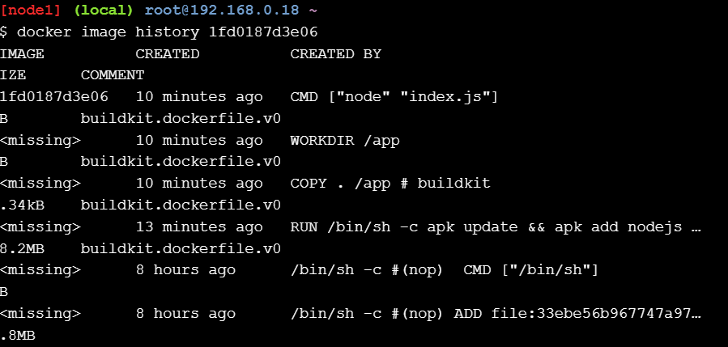

Lo que ves es la lista de imágenes de contenedores intermedios que se crearon durante el proceso de creación de la imagen final de tu aplicación Node.js. Algunas de estas imágenes intermedias se convertirán en capas en la imagen final del contenedor. En la salida del comando history, las capas originales de Alpine están al final de la lista y, luego, cada personalización que agregamos en nuestro Dockerfile es su propio paso en la salida. Este es un concepto poderoso porque significa que, si necesitamos hacer un cambio en nuestra aplicación, ¡puede que solo afecte a una sola capa! Para ver esto, modificaremos un poco nuestra aplicación y crearemos una nueva imagen.

Escriba lo siguiente en la ventana de su consola:

```echo "console.log(\"this is v0.2\");" >> index.js```

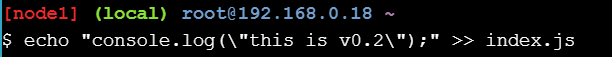

Esto agregará una nueva línea al final del archivo index.js de antes, de modo que su aplicación generará una línea de texto adicional. Ahora crearemos una nueva imagen usando nuestro código actualizado. También etiquetaremos nuestra nueva imagen para marcarla como una nueva versión, de modo que cualquier persona que consuma nuestras imágenes más adelante pueda identificar la versión correcta que debe usar:

```docker image build -t hello:v0.2 .```
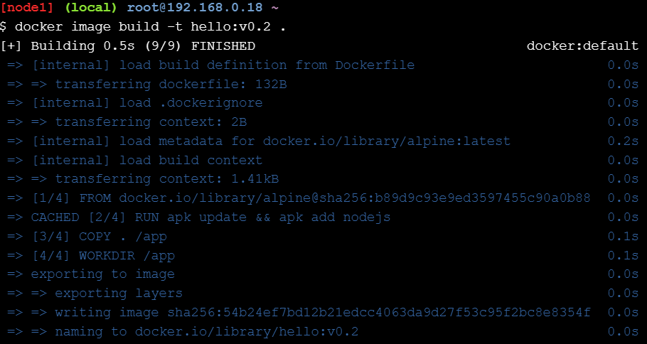
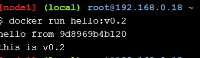
### Image Inspection

Ahora, cambiemos un poco nuestro modo de pensar. ¿Qué sucede si obtenemos un contenedor de Docker Store u otro registro y queremos saber un poco sobre lo que hay dentro del contenedor que estamos consumiendo? Docker tiene un comando de inspección para imágenes y devuelve detalles sobre la imagen del contenedor, los comandos que ejecuta, el sistema operativo y más.

La imagen alpina ya debería estar presente localmente en los ejercicios anteriores (use docker image lspara confirmar), si no es así, ejecute el siguiente comando para extraerla:

```docker image pull alpine```
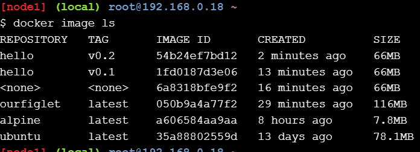

Una vez que estemos seguros de que está allí, inspeccionémoslo.

```docker image inspect alpine```
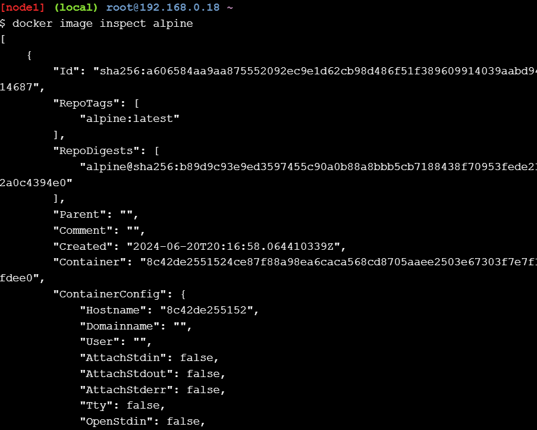

Hay mucha información ahí:

- las capas de las que se compone la imagen
- El controlador utilizado para almacenar las capas.
- La arquitectura/sistema operativo para el que fue creado
- metadatos de la imagen

No entraremos en todos los detalles aquí, pero podemos usar algunos filtros para inspeccionar detalles particulares de la imagen. Es posible que hayas notado que la información de la imagen está en formato JSON. Podemos aprovechar eso para usar el comando inspect con alguna información de filtrado para obtener datos específicos de la imagen.

Obtengamos la lista de capas:

```docker image inspect --format "{{ json .RootFS.Layers }}" alpine```
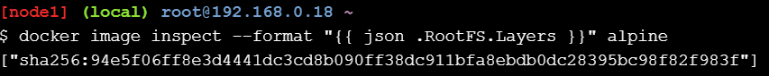

```docker image inspect --format "{{ json .RootFS.Layers }}" <image ID>```
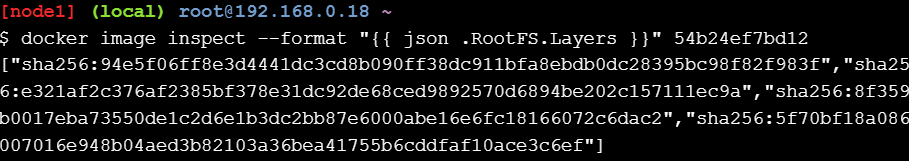

# Terminología
- Capas : una imagen de Docker se construye a partir de una serie de capas. Cada capa representa una instrucción en el Dockerfile de la imagen. Cada capa, excepto la última, es de solo lectura.
- Dockerfile : un archivo de texto que contiene todos los comandos, en orden, necesarios para crear una imagen determinada. La página de referencia de Dockerfile enumera los distintos comandos y detalles de formato de los Dockerfiles.
- Volúmenes : una capa especial de contenedor de Docker que permite que los datos persistan y se compartan por separado del contenedor en sí. Piense en los volúmenes como una forma de abstraer y administrar sus datos persistentes por separado de la aplicación en sí.