# Deploy and Managing Multiple Containers

Hasta ahora hemos explorado el uso de instancias individuales de contenedores ejecutándose en un único host, de forma similar a como lo haría un desarrollador cuando trabaja en una única aplicación de servicio o como lo haría un administrador de TI en un equipo de pruebas. Las aplicaciones de producción suelen ser mucho más complejas y este modelo de servidor único no funcionará para coordinar decenas o cientos de contenedores y las conexiones de red entre ellos, sin mencionar la necesidad de garantizar la disponibilidad y la capacidad de escalar.

Para aplicaciones reales, los usuarios de TI y los equipos de aplicaciones necesitan herramientas más sofisticadas. Docker ofrece dos de esas herramientas: Docker Compose y Docker Swarm Mode . Las dos herramientas tienen algunas similitudes, pero también algunas diferencias importantes:

- **Compose** se utiliza para controlar varios contenedores en un único sistema. Al igual que el Dockerfile que analizamos para crear una imagen, hay un archivo de texto que describe la aplicación: qué imágenes utilizar, cuántas instancias, las conexiones de red, etc. Pero Compose solo se ejecuta en un único sistema, por lo que, si bien es útil, omitiremos Compose 1 y pasaremos directamente al modo Docker Swarm .
- **El modo Swarm** le indica a Docker que ejecutará muchos motores Docker y que desea coordinar las operaciones entre todos ellos. El modo Swarm combina la capacidad no solo de definir la arquitectura de la aplicación, como Compose, sino también de definir y mantener altos niveles de disponibilidad, escalabilidad, equilibrio de carga y más. Con toda esta funcionalidad, el modo Swarm se usa con más frecuencia en entornos de producción que su primo más simple, Compose.

## La aplicación
La aplicación de votación es una aplicación multicontenedor que se suele utilizar con fines de demostración durante reuniones y conferencias de Docker. Básicamente, permite a los usuarios votar entre dos opciones, siendo las predeterminadas “gato” y “perro”, pero también podría ser “espacio” o “tabulador”, si así lo desea. Esta aplicación está disponible en Github y se actualiza con mucha frecuencia cuando se desarrollan nuevas funciones.

## Inicializa tu enjambre
Lo primero que debemos hacer es indicar a nuestros hosts de Docker que queremos utilizar el modo Docker Swarm. Los enjambres pueden ser de un solo nodo, pero esto es poco habitual, ya que no tendría capacidades de alta disponibilidad y limitaría gravemente su escalabilidad. La mayoría de los enjambres de producción tienen al menos tres nodos de administrador y muchos nodos de trabajo . Tres administradores es el mínimo para tener un verdadero clúster de alta disponibilidad con quórum. Tenga en cuenta que los nodos de administrador pueden ejecutar sus tareas de contenedor de la misma manera que un nodo de trabajo, pero esta funcionalidad también se puede separar para que los administradores solo realicen las tareas de administración.

Inicializar el modo Docker Swarm es fácil. En la primera ventana de terminal denominada [node1], ingrese lo siguiente:

```docker swarm init --advertise-addr $(hostname -i)```

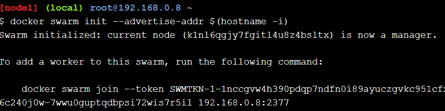


### Show Swarm Members


Desde la primera ventana de terminal, verifique la cantidad de nodos en el enjambre (ejecutar este comando desde el segundo nodo de trabajo de terminal fallará ya que los comandos relacionados con el enjambre deben emitirse contra un administrador de enjambre).

```docker node ls```
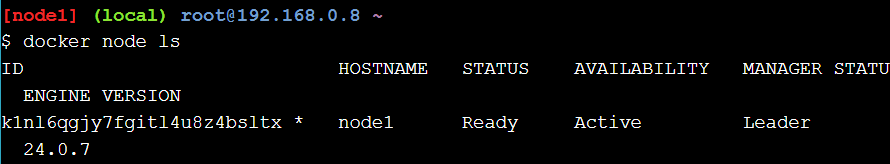

El comando anterior debería generar 2 nodos, el primero de los cuales es el administrador y el segundo, un trabajador. Debería ver que su nodo administrador también es el "líder". Esto se debe a que solo tiene un nodo administrador. El líder es exactamente lo que parece: el nodo de control principal para todos los administradores. Si su nodo líder deja de funcionar por alguna razón, los otros nodos administradores elegirán un nuevo líder; solo una de las razones por las que siempre tendría múltiples nodos administradores en una verdadera producción.

Aquí se muestra una vista de los administradores y trabajadores en el modo Docker Swarm. En nuestro ejercicio, solo tenemos un administrador y un trabajador, pero puede ver cómo interactúan varios administradores y trabajadores en el diagrama: 

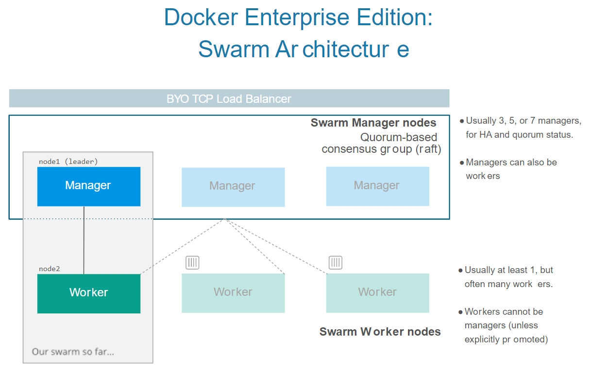
### Clone the Voting App
Ahora, para hacer algo interesante, recuperaremos el código de la aplicación de votación de muestra de Github.

Asegúrate de estar en la primera terminal (el administrador) e ingresa los dos comandos siguientes:


```
git clone https://github.com/docker/example-voting-app
cd example-voting-app
```

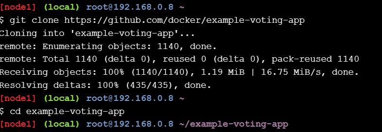
### Deploy a Stack

Una pila es un grupo de servicios que se implementan juntos: varios componentes en contenedores de una aplicación que se ejecutan en instancias separadas. Cada servicio individual puede estar compuesto de uno o más contenedores, llamados tareas , y luego todas las tareas y servicios juntos conforman una pila .

Al igual que con los archivos Dockerfiles y Compose, el archivo que define una pila es un archivo de texto sin formato que es fácil de editar y rastrear. En nuestro ejercicio, hay un archivo llamado docker-stack.ymlen la carpeta actual que se usará para implementar la aplicación de votación como una pila. Ingrese lo siguiente para investigar el docker-stack.yml archivo:

```cat docker-stack.yml```

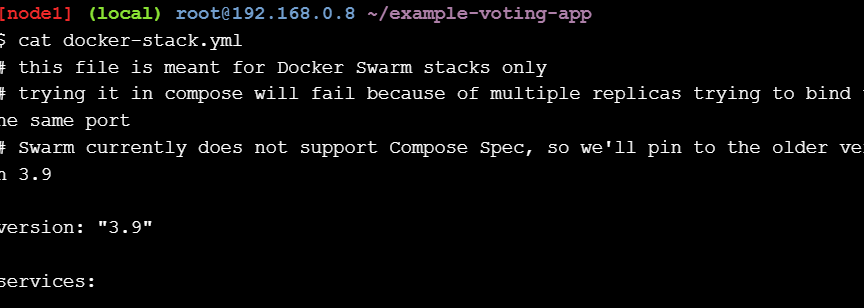

Asegúrese de estar en la terminal del administrador [node1] y haga lo siguiente:

```docker stack deploy --compose-file=docker-stack.yml voting_stack```
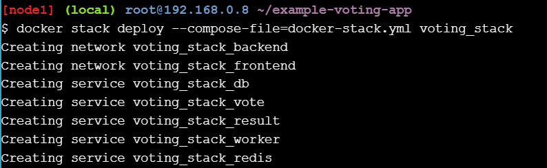

Puede ver si la pila se implementó desde la terminal del administrador [node1]

```docker stack ls```

El resultado debería ser el siguiente. Indica que se han implementado los 6 servicios de la pila de la aplicación de votación (denominada voting_stack).

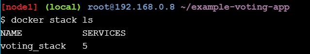

Podemos obtener detalles de cada servicio dentro de la pila con lo siguiente:

```docker stack services voting_stack```

El resultado debería ser similar al siguiente, aunque naturalmente sus identificaciones serán únicas:

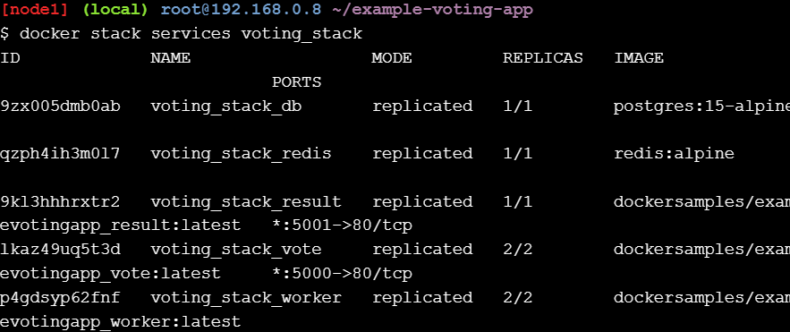

Si ves que no hay réplicas, espera unos segundos y vuelve a ingresar el comando. Swarm finalmente pondrá en funcionamiento todas las réplicas. Tal como docker-stackse especifica en nuestro archivo, hay dos réplicas del servicio voting_stack_vote y una de cada uno de los otros.

Enumeremos las tareas del servicio electoral.

```docker service ps voting_stack_vote```

Debería obtener una salida como la siguiente, donde se enumeran las 2 tareas (réplicas) del servicio.

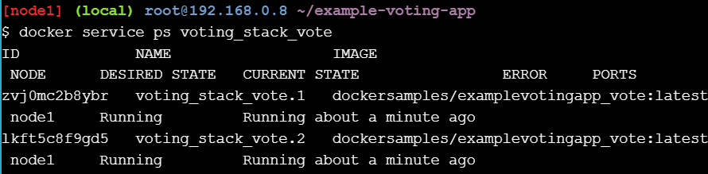

Desde la columna NODO, podemos ver que se está ejecutando una tarea en cada nodo. Esta aplicación tiene un VISUALIZADOR DE ENJAMBRE integrado para mostrarte cómo está configurada y funcionando la aplicación. También puedes acceder a la interfaz web de la aplicación para emitir tu voto por perros o gatos y hacer un seguimiento de cómo van los votos en la página de resultados . Intenta abrir la interfaz varias veces para poder emitir varios votos. Deberías ver que el "ID del contenedor" que aparece en la parte inferior de la página de votación cambia, ya que tenemos dos réplicas en ejecución.

El VISUALIZADOR SWARM le brinda el diseño físico de la pila, pero aquí hay una interpretación lógica de cómo se interrelacionan las pilas, los servicios y las tareas:

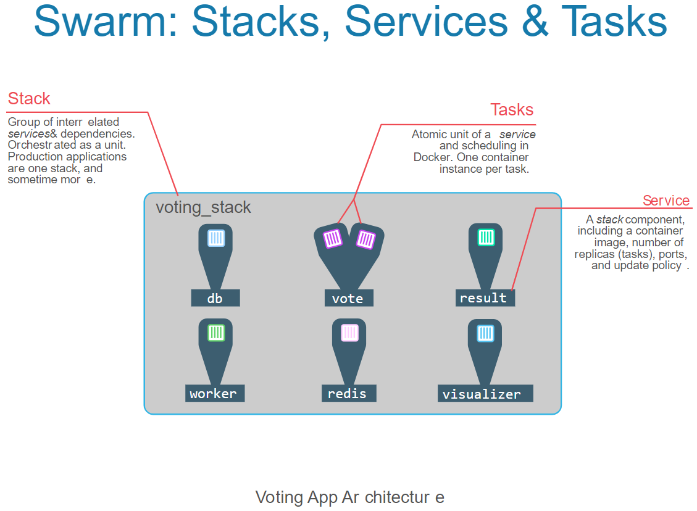

### Scaling An Application
Supongamos que nuestra votación de gatos contra perros se ha vuelto viral y nuestros dos servidores web front-end ya no pueden manejar la carga. ¿Cómo podemos indicarle a nuestra aplicación que agregue más réplicas de nuestro servicio de votación ? En producción, puede automatizarlo a través de las API de Docker, pero por ahora lo haremos manualmente. También puede editar el docker-stack.ymlarchivo y cambiar las especificaciones si desea que el tamaño de la escala sea más permanente. Escriba lo siguiente en la terminal [node1]:

```docker service scale voting_stack_vote=5```
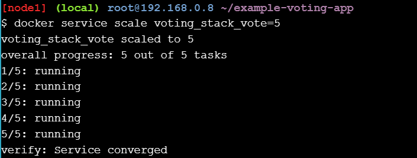

Ahora, ingresa nuevamente tu docker stack services voting_stackcomando. Deberías ver que la cantidad de réplicas para el servicio de votación aumenta a 5 y en unos segundos Swarm las tendrá todas en funcionamiento. Regresa a la interfaz de usuario de votación de tu frontend y actualiza la página varias veces. Deberías ver que el ID del contenedor que aparece en la parte inferior recorre los 5 contenedores. Si regresas y actualizas tu SWARM VISUALIZER, también deberías ver tu arquitectura actualizada allí.

Aquí está nuestra nueva arquitectura después del escalado:
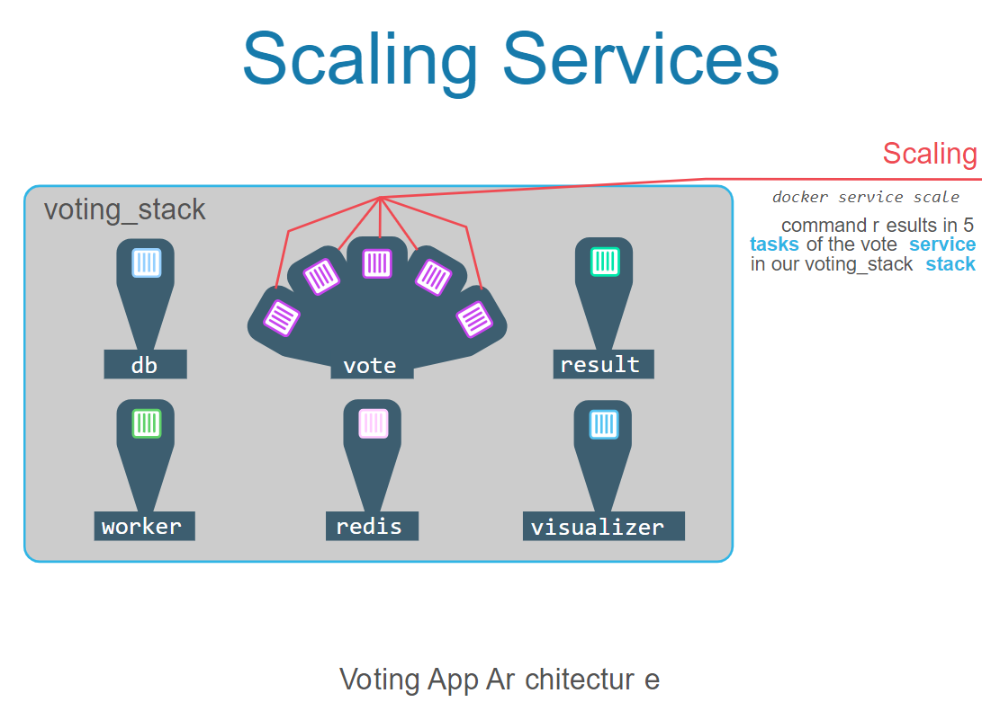

¡Eso es todo! Docker Swarm puede escalar de forma fácil y rápida los servicios de su aplicación hacia arriba y hacia abajo según lo requieran las necesidades. Nuevamente, en muchas situaciones probablemente querrá automatizar esto en lugar de escalar manualmente, lo cual es bastante fácil a través de las API de Docker. También tiene la opción de cambiar el balanceador de carga integrado por algo con controles adicionales, como F5 o Citrix NetScaler o algún otro software que prefiera.

## Conclusión
Con solo un par de comandos, puede implementar una pila de servicios usando el modo Docker Swarm para orquestar toda la pila, todo mantenido en el formato de archivo Docker Compose simple y legible para humanos.

## ¿Qué sigue?
Con suerte, estos primeros laboratorios le habrán proporcionado cierta familiaridad con Docker, los contenedores y la orquestación del modo Docker Swarm. Le recomendamos que siga jugando con Docker para aprender más. Hay varias cosas que puede hacer para continuar su aprendizaje:

1. Continúe aprendiendo aquí mismo en el aula Play With Docker con la Fase 2 y la Fase 3 de la ruta de aprendizaje Docker para profesionales de TI y administradores de sistemas.
En la Fase 2 aprenderá más sobre orquestación, seguridad y redes.
La fase 3 unificará todo a medida que implemente una aplicación de prueba de concepto.

2. Ejecute los laboratorios localmente en su máquina. Puede descargar los clientes gratuitos Docker para Mac o Docker para Windows y ejecutar algunos de estos laboratorios directamente en su propia máquina.
También puedes registrarte para obtener una cuenta gratuita de Docker Store . Obtendrás un repositorio Docker gratuito propio para que puedas intentar tomar las imágenes que creamos en estos laboratorios y almacenarlas en el centro comunitario.
