# Docker Networking Hands-on Lab
En este laboratorio, aprenderá sobre conceptos clave de redes Docker. Se pondrá manos a la obra revisando ejemplos de algunos conceptos básicos de redes, aprenderá sobre redes Bridge y, por último, sobre redes Overlay.

Tareas :

- Sección n.° 1: Conceptos básicos de redes
- Sección n.° 2: Redes de puentes
- Sección n.° 3: Redes superpuestas
- Limpiar
## Section #1 - Networking Basics
**Step 1: The Docker Network Command**

El docker networkcomando es el comando principal para configurar y administrar redes de contenedores. Ejecute el docker networkcomando desde la primera terminal.

```docker network```

El resultado del comando muestra cómo utilizar el comando y todos los docker networksubcomandos. Como puede ver en el resultado, el docker networkcomando le permite crear nuevas redes, enumerar redes existentes, inspeccionar redes y eliminar redes. También le permite conectar y desconectar contenedores de las redes.

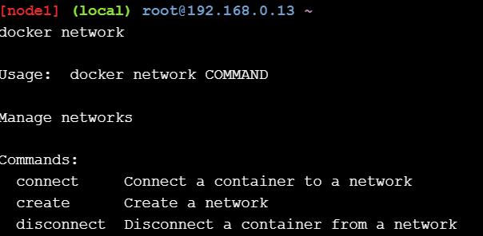

**Step 2: List networks**

Ejecute un docker network lscomando para ver las redes de contenedores existentes en el host Docker actual.

```docker network ls```

La salida anterior muestra las redes de contenedores que se crean como parte de una instalación estándar de Docker.

Las nuevas redes que cree también aparecerán en la salida del docker network lscomando.

Puede ver que cada red obtiene un IDy único NAME. Cada red también está asociada con un solo controlador. Observe que la red "puente" y la red "host" tienen el mismo nombre que sus respectivos controladores.

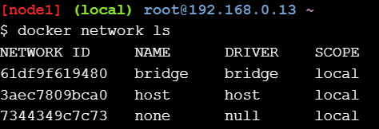

**Step 3: Inspect a network**
Inspecciona la red bridge con docker network inspect bridge.

El docker network inspectcomando se utiliza para ver los detalles de configuración de la red. Estos detalles incluyen: nombre, ID, controlador, controlador IPAM, información de subred, contenedores conectados y más.

Úselo docker network inspect <network>para ver los detalles de configuración de las redes de contenedores en su host Docker. El siguiente comando muestra los detalles de la red denominada bridge.

```docker network inspect bridge```
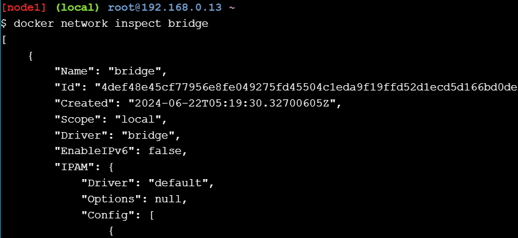

**NOTA:** La sintaxis del docker network inspectcomando es docker network inspect <network>, donde <network>puede ser el nombre de la red o el ID de la red. En el ejemplo anterior, mostramos los detalles de configuración de la red denominada “bridge”. No lo confunda con el controlador “bridge”.

#### Step 4: List network driver plugins

El docker infocomando muestra mucha información interesante sobre una instalación de Docker.

Ejecute el docker infocomando y localice la lista de complementos de red.

```docker info```
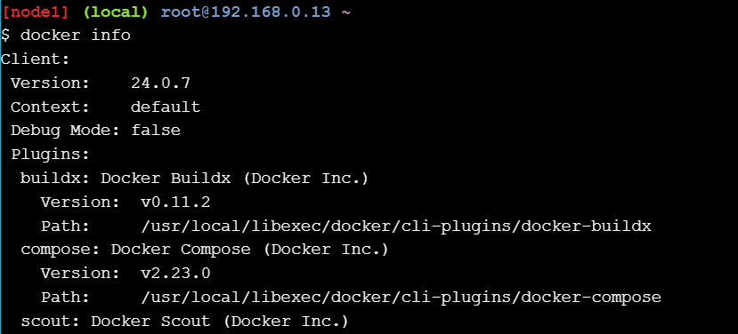

La salida anterior muestra los controladores de puente , host , macvlan , null y superposición .

## Section #2 - Bridge Networking
**Step 1: The Basics**

Cada instalación limpia de Docker viene con una red preconstruida llamada bridge . Verifíquelo con docker network ls.

```docker network ls```
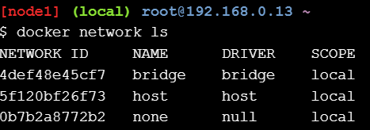

El resultado anterior muestra que la red de puente está asociada con el controlador de puente . Es importante tener en cuenta que la red y el controlador están conectados, pero no son lo mismo. En este ejemplo, la red y el controlador tienen el mismo nombre, ¡pero no son lo mismo!

El resultado anterior también muestra que la red de puente tiene un alcance local. Esto significa que la red solo existe en este host de Docker. Esto es así para todas las redes que utilizan el controlador de puente : el controlador de puente proporciona redes de un solo host.

Todas las redes creadas con el controlador de puente se basan en un puente Linux (también conocido como un conmutador virtual).

Instala el brctlcomando y úsalo para enumerar los puentes Linux en tu host Docker. Puedes hacerlo ejecutando sudo apt-get install bridge-utils.

```
apk update
apk add bridge
```

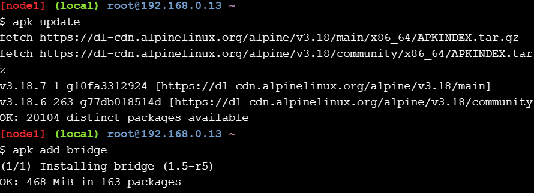

Luego, enumera los puentes en tu host Docker ejecutando brctl show.

```
brctl show
```

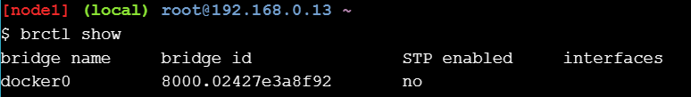

El resultado anterior muestra un único puente Linux llamado docker0 . Este es el puente que se creó automáticamente para la red de puentes . Puedes ver que actualmente no tiene interfaces conectadas a él.

También puede utilizar el ip acomando para ver los detalles del puente docker0 .

```ip a```

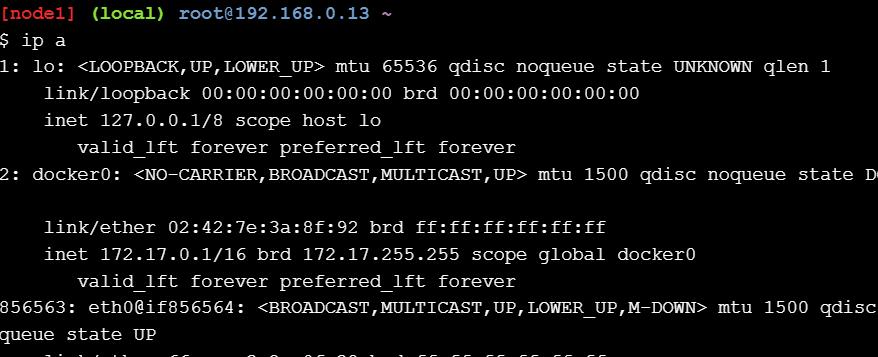

**Step 2: Connect a container**

La red puente es la red predeterminada para los contenedores nuevos. Esto significa que, a menos que especifique una red diferente, todos los contenedores nuevos se conectarán a la red puente .

Cree un nuevo contenedor ejecutando docker run -dt ubuntu sleep infinity.

```docker run -dt ubuntu sleep infinity```
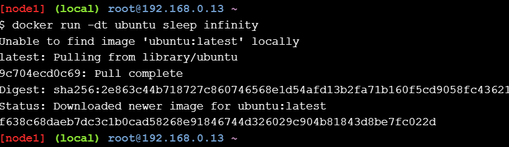

Este comando creará un nuevo contenedor basado en la ubuntu:latestimagen y ejecutará el sleepcomando para mantener el contenedor en ejecución en segundo plano. Puede verificar que nuestro contenedor de ejemplo esté activo ejecutando docker ps.

```docker ps```
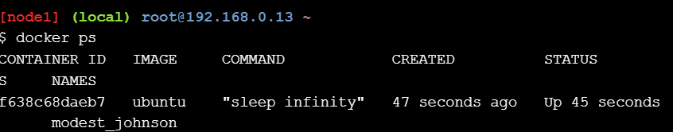

Como no se especificó ninguna red en el docker runcomando, el contenedor se agregará a la red del puente .

Ejecute el brctl showcomando nuevamente.

```brctl show```
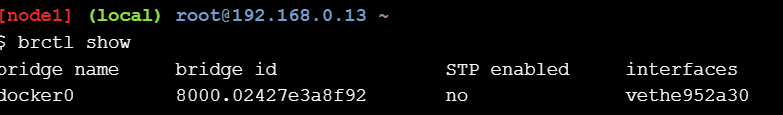

Observe cómo el puente docker0 ahora tiene una interfaz conectada. Esta interfaz conecta el puente docker0 al nuevo contenedor que acaba de crear.

Puedes inspeccionar la red del puente nuevamente, ejecutando docker network inspect bridge, para ver el nuevo contenedor adjunto a ella.

```docker network inspect bridge```
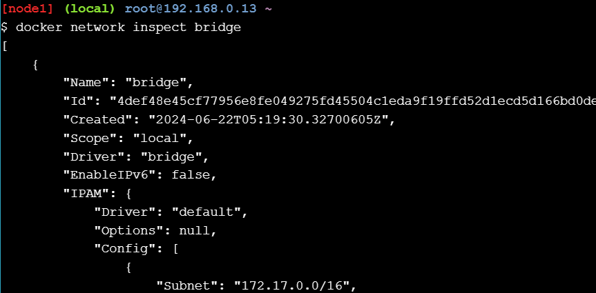

**Step 3: Test network connectivity**

La salida del docker network inspectcomando anterior muestra la dirección IP del nuevo contenedor. En el ejemplo anterior es “172.17.0.2”, pero la tuya puede ser diferente.

Haga ping a la dirección IP del contenedor desde el indicador de shell de su host Docker ejecutando ping -c5 <IPv4 Address>. Recuerde utilizar la IP del contenedor en su entorno.

Las respuestas anteriores muestran que el host de Docker puede hacer ping al contenedor a través de la red de puente . Pero también podemos verificar que el contenedor también pueda conectarse al mundo exterior. Inicie sesión en el contenedor, instale el pingprograma y luego haga ping www.github.com.

Primero, necesitamos obtener el ID del contenedor que iniciamos en el paso anterior. Puedes ejecutarlo docker pspara obtenerlo.

```docker ps```
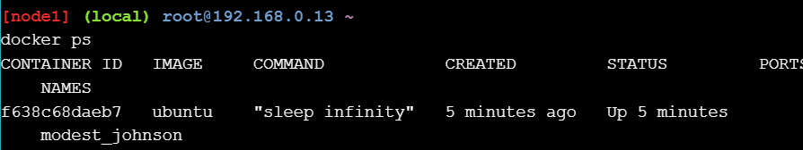

A continuación, ejecutemos un shell dentro de ese contenedor de Ubuntu, ejecutando docker exec -it <CONTAINER ID> /bin/bash.

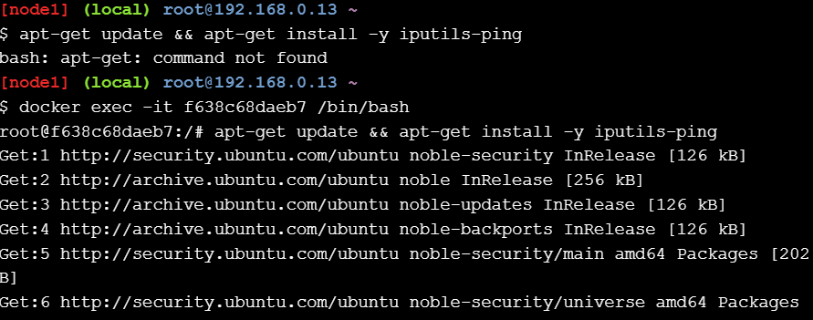

A continuación, tenemos que instalar el programa ping. Ejecutémoslo apt-get update && apt-get install -y iputils-ping.

```apt-get update && apt-get install -y iputils-ping```

Hagamos ping a www.github.com ejecutandoping -c5 www.github.com

```ping -c5 www.github.com```
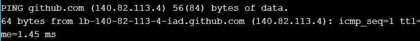
Por último, desconectemos nuestro shell del contenedor, ejecutando exit.

```
exit
```

También deberíamos detener este contenedor para limpiar los errores de esta prueba ejecutando docker stop <CONTAINER ID>.

**Step 4: Configure NAT for external connectivity**

In this step we’ll start a new NGINX container and map port 8080 on the Docker host to port 80 inside of the container. This means that traffic that hits the Docker host on port 8080 will be passed on to port 80 inside the container.

Start a new container based off the official NGINX image by running docker run --name web1 -d -p 8080:80 nginx.


```docker run --name web1 -d -p 8080:80 nginx```

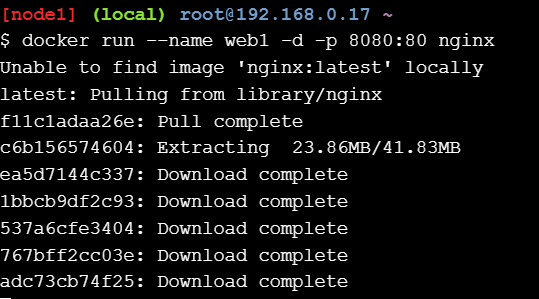

Review the container status and port mappings by running docker ps.

```docker ps```
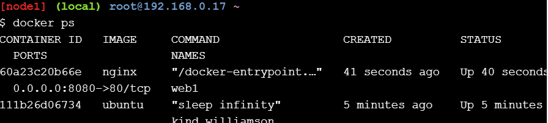

The top line shows the new web1 container running NGINX. Take note of the command the container is running as well as the port mapping - 0.0.0.0:8080->80/tcp maps port 8080 on all host interfaces to port 80 inside the web1 container. This port mapping is what effectively makes the containers web service accessible from external sources (via the Docker hosts IP address on port 8080).

Now that the container is running and mapped to a port on a host interface you can test connectivity to the NGINX web server.

To complete the following task you will need the IP address of your Docker host. This will need to be an IP address that you can reach (e.g. your lab is hosted in Azure so this will be the instance’s Public IP - the one you SSH’d into). Just point your web browser to the IP and port 8080 of your Docker host. Also, if you try connecting to the same IP address on a different port number it will fail.

If for some reason you cannot open a session from a web broswer, you can connect from your Docker host using the curl 127.0.0.1:8080 command.

```curl 127.0.0.1:8080```

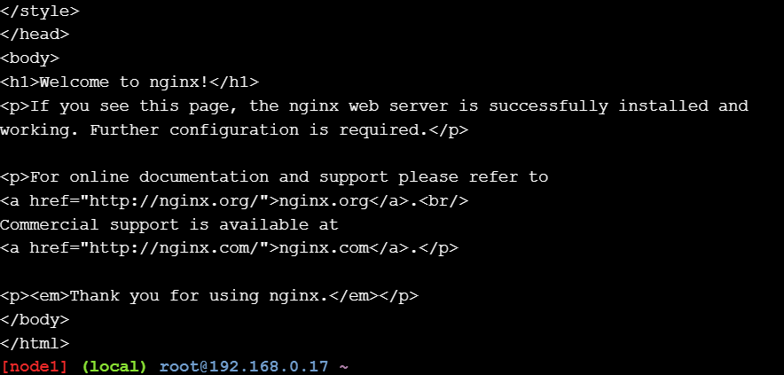

## Section #3 - Overlay Networking
**Step 1: The Basics**

In this step you’ll initialize a new Swarm, join a single worker node, and verify the operations worked.

```Run docker swarm init --advertise-addr $(hostname -i).```

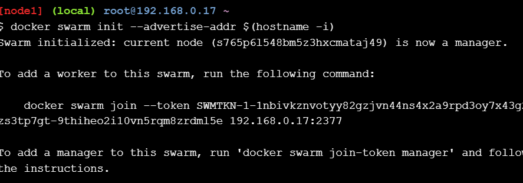

In the first terminal copy the entire docker swarm join ... command that is displayed as part of the output from your terminal output. Then, paste the copied command into the second terminal.

Run a docker node ls to verify that both nodes are part of the Swarm.

```docker node ls```

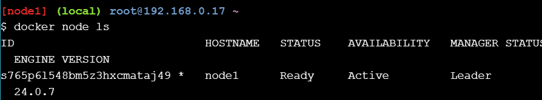

The ID and HOSTNAME values may be different in your lab. The important thing to check is that both nodes have joined the Swarm and are ready and active.

**Step 2: Create an overlay network**

Now that you have a Swarm initialized it’s time to create an overlay network.

Create a new overlay network called “overnet” by running docker network create -d overlay overnet.

```docker network create -d overlay overnet```

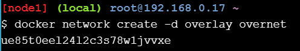

Use the docker network ls command to verify the network was created successfully.

```docker network ls```

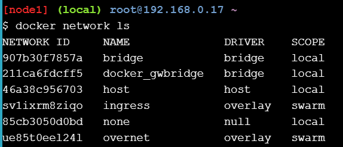

Run the same docker network ls command from the second terminal.

```docker network ls```

Tenga en cuenta que la red “overnet” no aparece en la lista. Esto se debe a que Docker solo extiende las redes superpuestas a los hosts cuando son necesarias. Esto suele ocurrir cuando un host ejecuta una tarea desde un servicio que se crea en la red. Veremos esto en breve.

Utilice el docker network inspect <network>comando para ver información más detallada sobre la red “overnet”. Deberá ejecutar este comando desde la primera terminal.

```docker network inspect overnet```

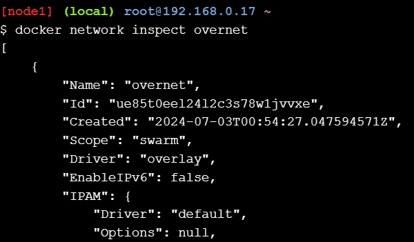

**Step 3: Create a service**

Ahora que tenemos un Swarm inicializado y una red superpuesta, es momento de crear un servicio que utilice la red.

Ejecute el siguiente comando desde la primera terminal para crear un nuevo servicio llamado myservice en la red overnet con dos tareas/réplicas.

```
docker service create --name myservice \
--network overnet \
--replicas 2 \
ubuntu sleep infinity

```
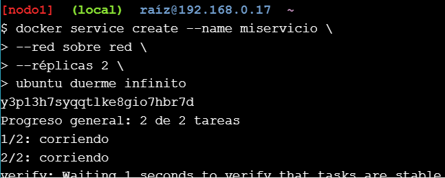

Verifique que el servicio esté creado y que ambas réplicas estén activas ejecutando docker service ls.

```docker service ls```
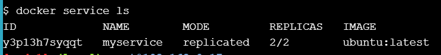

The 2/2 in the REPLICAS column shows that both tasks in the service are up and running.

Verify that a single task (replica) is running on each of the two nodes in the Swarm by running docker service ps myservice.

```docker service ps myservice```

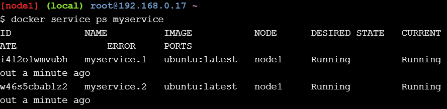

The ID and NODE values might be different in your output. The important thing to note is that each task/replica is running on a different node.

Now that the second node is running a task on the “overnet” network it will be able to see the “overnet” network. Lets run docker network ls from the second terminal to verify this.

```docker network ls```

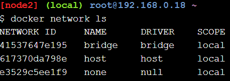

También podemos ejecutar docker network inspect overneten el segundo terminal para obtener información más detallada sobre la red “overnet” y obtener la dirección IP de la tarea que se ejecuta en el segundo terminal.

```docker network inspect overnet```

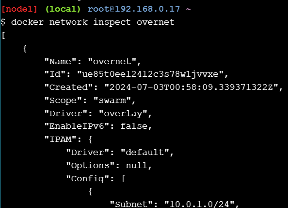
Debe tener en cuenta que, a partir de Docker 1.12, docker network inspectsolo se muestran los contenedores o las tareas que se ejecutan en el nodo local. Esto significa que 10.0.0.3es la dirección IPv4 del contenedor que se ejecuta en el segundo nodo. Anote esta dirección IP para el siguiente paso (la dirección IP en su laboratorio puede ser diferente a la que se muestra aquí en la guía del laboratorio).


**Step 4: Test the network**

Para completar este paso, necesitará la dirección IP de la tarea de servicio que se ejecuta en el nodo 2 que vio en el paso anterior ( 10.0.0.3).

Ejecute los siguientes comandos desde la primera terminal.

```docker network inspect overnet```


Tenga en cuenta que la dirección IP indicada para la tarea de servicio (contenedor) que se está ejecutando es diferente a la dirección IP de la tarea de servicio que se está ejecutando en el segundo nodo. Tenga en cuenta también que están en la misma red "overnet".

Ejecute un docker pscomando para obtener el ID de la tarea de servicio para que pueda iniciar sesión en ella en el siguiente paso.

```docker ps```

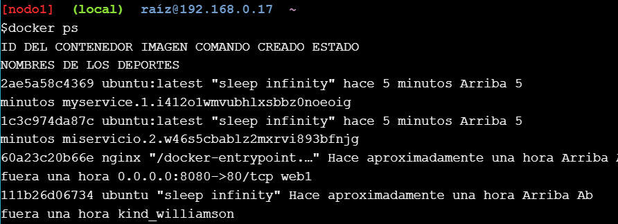

Inicie sesión en la tarea de servicio. Asegúrese de utilizar el contenedor IDde su entorno, ya que será diferente del ejemplo que se muestra a continuación. Podemos hacerlo ejecutando docker exec -it <CONTAINER ID> /bin/bash.

Instale el comando ping y haga ping a la tarea de servicio que se ejecuta en el segundo nodo donde tenía una dirección IP del 10.0.0.3comando docker network inspect overnet.

```apt-get update && apt-get install -y iputils-ping```

Ahora, hagamos ping 10.0.0.3.

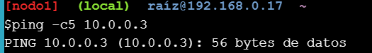

El resultado anterior muestra que ambas tareas del servicio myservice están en la misma red superpuesta que abarca ambos nodos y que pueden usar esta red para comunicarse.


**Step 5: Test service discovery**

Ahora que tiene un servicio en funcionamiento que utiliza una red superpuesta, probemos el descubrimiento de servicios.

Si todavía no se encuentra dentro del contenedor, vuelva a iniciar sesión con el docker exec -it <CONTAINER ID> /bin/bashcomando.

Ejecutar cat /etc/resolv.confformulario dentro del contenedor.
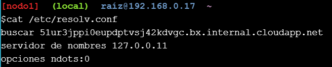

El valor que nos interesa es nameserver 127.0.0.11. Este valor envía todas las consultas DNS del contenedor a un solucionador DNS integrado que se ejecuta dentro del contenedor y que escucha en 127.0.0.11:53. Todos los contenedores Docker ejecutan un servidor DNS integrado en esta dirección.


Inspeccione la configuración del servicio “myservice” ejecutando docker service inspect myservice. Verifiquemos que el valor VIP coincida con el valor devuelto por el ping -c5 myservicecomando anterior.

```docker service inspect myservice```

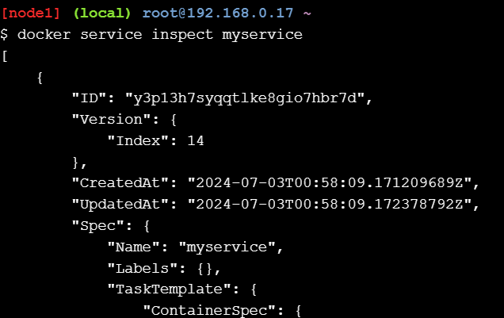

Hacia la parte inferior del resultado, verá el VIP del servicio indicado. El VIP que aparece en el resultado anterior es , 10.0.0.2pero el valor puede ser diferente en su configuración. El punto importante a tener en cuenta es que el VIP que aparece aquí coincide con el valor devuelto por el ping -c5 myservicecomando.

No dude en crear una nueva docker execsesión para la tarea de servicio (contenedor) que se ejecuta en el nodo 2 y ejecutar el mismo ping -c5 servicecomando. Recibirá una respuesta del mismo VIP.

## Cleaning Up

Esperamos que hayas podido aprender un poco sobre cómo funciona Docker Networking durante este laboratorio. Limpiemos el servicio que creamos, los contenedores que iniciamos y, por último, desactivemos el modo Swarm.

Ejecute el docker service rm myservicecomando para eliminar el servicio llamado myservice .

```docker service rm myservice```
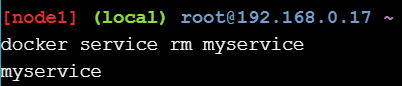
Ejecute el docker pscomando para obtener una lista de contenedores en ejecución.

```docker ps```

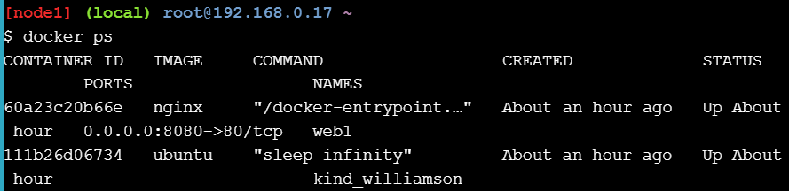

Puedes usar el docker kill <CONTAINER ID ...>comando para matar los contenedores ubunut y nginx que iniciamos al principio.

```docker kill yourcontainerid1 yourcontainerid2```
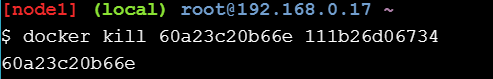

Por último, eliminemos los nodos 1 y 2 del enjambre. Podemos usar el docker swarm leave --forcecomando para hacerlo.

Vamos a ejecutarlo docker swarm leave --forceen el nodo1.

```docker swarm leave --force```
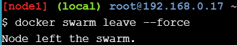

También podemos ejecutarlo docker swarm leave --forceen el nodo 2.

```docker swarm leave --force```


¡Felicitaciones! ¡Has completado este laboratorio!