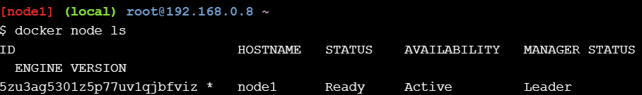
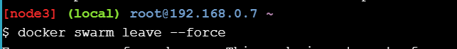

# Laboratorio práctico de orquestación de Docker

En este laboratorio, experimentará con las características de orquestación de contenedores de Docker. Implementará una aplicación simple en un solo host y aprenderá cómo funciona. Luego, configurará el modo Docker Swarm y aprenderá a implementar la misma aplicación simple en varios hosts. Luego, verá cómo escalar la aplicación y mover la carga de trabajo entre diferentes hosts fácilmente.

## Sección 1: ¿Qué es la orquestación?
Entonces, ¿qué es la orquestación? Bueno, la mejor manera de describirla es con un ejemplo. Supongamos que tienes una aplicación con mucho tráfico y requisitos de alta disponibilidad. Debido a estos requisitos, normalmente quieres implementarla en al menos 3 máquinas, de modo que en caso de que falle un host, tu aplicación siga siendo accesible desde al menos otros dos. Obviamente, esto es solo un ejemplo y tu caso de uso probablemente tendrá sus propios requisitos, pero ya entiendes la idea.

Implementar su aplicación sin orquestación suele demandar mucho tiempo y ser propenso a errores, ya que tendría que acceder manualmente por SSH a cada máquina, iniciar su aplicación y luego controlar continuamente las cosas para asegurarse de que funcione como espera.

Pero, con las herramientas de Orchestration, normalmente puedes descargar gran parte de este trabajo manual y dejar que la automatización haga el trabajo pesado. Una característica interesante de Orchestration con Docker Swarm es que puedes implementar una aplicación en muchos hosts con un solo comando (una vez que el modo Swarm está habilitado). Además, si uno de los nodos de soporte deja de funcionar en tu Docker Swarm, otros nodos asumirán la carga automáticamente y tu aplicación seguirá funcionando como siempre.

Si normalmente solo utiliza Docker docker runpara implementar sus aplicaciones, entonces probablemente pueda beneficiarse mucho al usar Docker Compose, el modo Docker Swarm o ambos.

## Sección 2: Configurar el modo enjambre
Como se mencionó anteriormente, las aplicaciones del mundo real suelen implementarse en varios hosts. Esto mejora el rendimiento y la disponibilidad de las aplicaciones, además de permitir que los componentes individuales de las aplicaciones se escalen de forma independiente. Docker cuenta con potentes herramientas nativas que lo ayudan a lograrlo.

Un ejemplo de ejecución manual de tareas y en un único host sería crear un nuevo contenedor en el nodo 1 ejecutando docker run -dt ubuntu sleep infinity.

```docker run -dt ubuntu sleep infinity```


Este comando creará un nuevo contenedor basado en la ubuntu:latestimagen y ejecutará el sleepcomando para mantener el contenedor en ejecución en segundo plano. Puede verificar que nuestro contenedor de ejemplo esté activo ejecutándose docker psen node1 .

```docker ps```


## Step 2.1 - Create a Manager node

En este paso, inicializará un nuevo enjambre, se unirá a un solo nodo de trabajo y verificará que las operaciones hayan funcionado.

Ejecutar docker swarm initen el nodo1 .

```docker swarm init --advertise-addr $(hostname -i)```


Puede ejecutar el docker infocomando para verificar que el nodo1 se haya configurado correctamente como nodo administrador de enjambre.

```docker info```


El enjambre ahora se inicializa con el nodo 1 como el único nodo administrador. En la siguiente sección, agregará el nodo 2 y el nodo 3 como nodos de trabajo .

## Paso 2.2 - Unir los nodos de trabajo al enjambre
Realizará el siguiente procedimiento en el nodo 2 y el nodo 3. Hacia el final del procedimiento, volverá al nodo 1 .

Ahora, tomamos el comando completo docker swarm join ...que copiamos antes desde node1donde se mostraba como salida de terminal. Necesitamos pegar el comando copiado en la terminal de node2 y node3 .

Debería verse algo así para el nodo 2. Por cierto, si el docker swarm join ...comando ya desapareció de tu pantalla, puedes ejecutarlo docker swarm join-token workeren el nodo Administrador para recuperarlo.


## Step 2.2 - Join Worker nodes to the Swarm

Una vez que hayas ejecutado esto en node2 y node3 , vuelve a node1 y ejecuta a docker node lspara verificar que ambos nodos sean parte del enjambre. Deberías ver tres nodos, node1 como nodo administrador y node2 y node3 como nodos trabajadores.

```docker node ls```



## Section 3: Deploy applications across multiple hosts

Ahora que tienes un enjambre en funcionamiento, es hora de implementar nuestra aplicación de sueño realmente sencilla.

Realizarás el siguiente procedimiento desde el nodo1 .

## Step 3.1 - Deploy the application components as Docker services

Nuestra sleepaplicación se está volviendo muy popular en Internet (debido a su aparición en Reddit y HN). A la gente le encanta. Por lo tanto, tendrá que escalar su aplicación para satisfacer la demanda máxima. También tendrá que hacerlo en varios hosts para lograr una alta disponibilidad. Usaremos el concepto de Servicios para escalar nuestra aplicación fácilmente y administrar muchos contenedores como una sola entidad.

Realizarás este procedimiento desde el nodo1 .

Implementémoslo sleepcomo un servicio en nuestro Docker Swarm.

```docker service create --name sleep-app ubuntu sleep infinity```


Verifique que service createel administrador de Swarm lo haya recibido.

```docker service ls```
El estado del servicio puede cambiar un par de veces hasta que se ejecute. La imagen se descarga desde Docker Store a los demás motores del enjambre. Una vez que se descarga la imagen, el contenedor pasa a un estado de ejecución en uno de los tres nodos.

En este punto, puede parecer que no hemos hecho nada muy diferente a ejecutar un docker run .... Nuevamente, hemos implementado un solo contenedor en un solo host. La diferencia aquí es que el contenedor se ha programado en un clúster de enjambre.

Bien hecho. Implementaste la aplicación Sleep en tu nuevo Swarm usando los servicios de Docker.


## Section 4: Scale the application

¡La demanda es increíble! ¡A todos les encanta tu sleepaplicación! Es hora de ampliarla.

Una de las ventajas de los servicios es que se pueden ampliar o reducir para satisfacer la demanda. En este paso, ampliarás y reducirás el servicio.

Realizarás el siguiente procedimiento desde el nodo1 .

Escale la cantidad de contenedores en el servicio sleep-appdocker service update --replicas 7 sleep-app a 7 con el comando. replicases el término que usamos para describir contenedores idénticos que brindan el mismo servicio.

```docker service update --replicas 7 sleep-app```


El administrador de Swarm programa de manera que haya 7 sleep-appcontenedores en el clúster. Estos se programarán de manera uniforme entre los miembros de Swarm.

Vamos a utilizar el docker service ps sleep-appcomando. Si lo haces lo suficientemente rápido después de utilizar la --replicasopción, podrás ver cómo aparecen los contenedores en tiempo real.

```docker service ps sleep-app```


Tenga en cuenta que ahora hay 7 contenedores enumerados. Es posible que pasen unos segundos hasta que todos los nuevos contenedores del servicio se muestren como RUNNING . La NODEcolumna nos indica en qué nodo se está ejecutando un contenedor.

Reduzca el servicio a solo cuatro contenedores con el docker service update --replicas 4 sleep-appcomando.

```docker service update --replicas 4 sleep-app```


Verifique que el número de contenedores se haya reducido a 4 mediante el docker service ps sleep-appcomando.

```docker service ps sleep-app```


## Section 5: Drain a node and reschedule the containers

Tu aplicación para dormir ha tenido un rendimiento increíble después de llegar a Reddit y HN. ¡Ahora es la número 1 en la App Store! Has aumentado tu capacidad durante las vacaciones y la has reducido durante la temporada baja. Ahora estás realizando tareas de mantenimiento en uno de tus servidores, por lo que tendrás que sacar un servidor del enjambre sin interrumpir el servicio a tus clientes.

Eche un vistazo al estado de sus nodos nuevamente ejecutando docker node lsen node1 .

```docker node ls```

Dejarás fuera de servicio el nodo 2 para realizar tareas de mantenimiento.

Veamos los contenedores que tienes ejecutándose en el nodo 2 .

```docker ps```


Puedes ver que tenemos uno de los contenedores slepp-app ejecutándose aquí (aunque tu salida puede verse diferente).

Ahora, volvamos al nodo 1 (el administrador de Swarm) y saquemos del servicio al nodo 2. Para ello, ejecutemos docker node lsde nuevo.

```docker node ls```


## Cleaning Up

Ejecute el docker service rm sleep-appcomando en el nodo1 para eliminar el servicio llamado myservice .

```docker service rm sleep-app```


Ejecute el docker pscomando en el nodo1 para obtener una lista de contenedores en ejecución.

```docker ps```


Por último, eliminemos los nodos 1, 2 y 3 del enjambre. Podemos usar el docker swarm leave --forcecomando para hacerlo.

Vamos a ejecutarlo docker swarm leave --forceen el nodo1 .

```docker swarm leave --force```


Luego, ejecuta docker swarm leave --forceen el nodo2 .

```docker swarm leave --force```


Por último, ejecute docker swarm leave --forceen el nodo3 .

```docker swarm leave --force```



¡Felicitaciones! Ha completado este laboratorio. Ahora sabe cómo crear un enjambre, implementar aplicaciones como colecciones de servicios y escalar servicios individuales hacia arriba y hacia abajo.