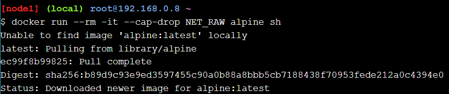
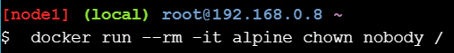
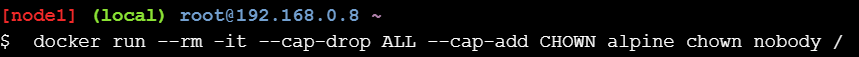
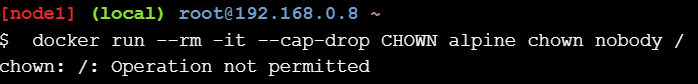
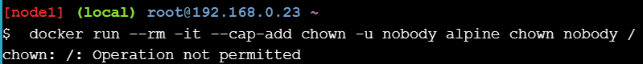
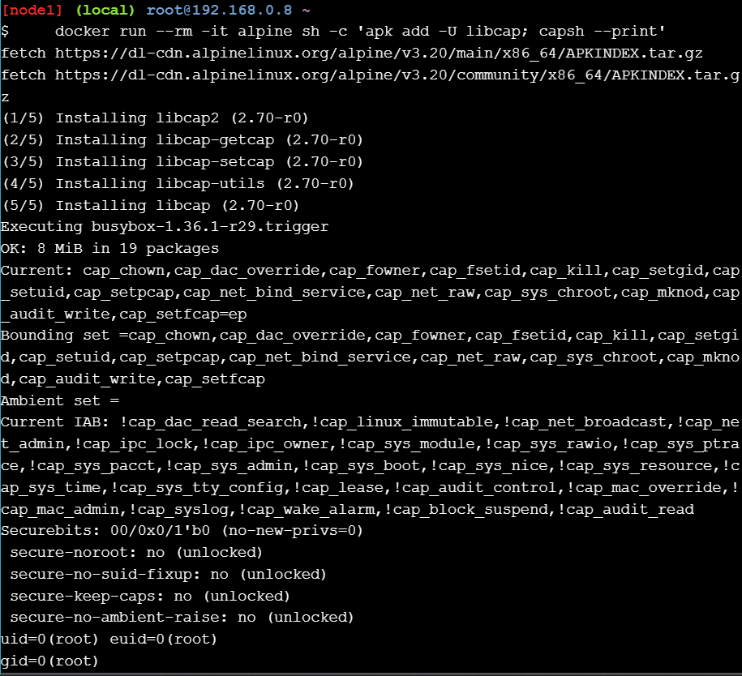
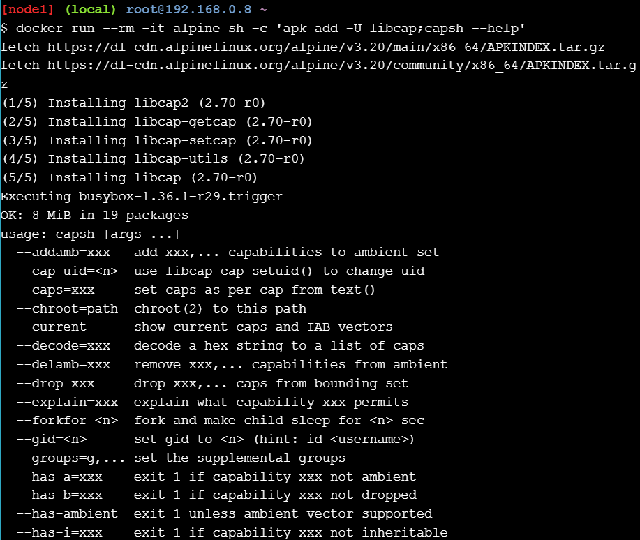

# Security Lab: Capabilities


Lab: Capabilities

En este laboratorio, aprenderá los conceptos básicos de las capacidades del núcleo de Linux. Aprenderá cómo funcionan con Docker, algunos comandos básicos para verlas y administrarlas, y cómo agregar y eliminar capacidades en contenedores nuevos.

Completarás los siguientes pasos como parte de este laboratorio.

- Paso 1 - Introducción a las capacidades
- Paso 2: Trabajar con Docker y sus capacidades
- Paso 3: Prueba de las capacidades de Docker
- Paso 4 - Extra para expertos


## Step 1 - Introduction to capabilities
En este paso aprenderá los conceptos básicos de las capacidades.

El núcleo de Linux puede dividir los privilegios del rootusuario en unidades distintas denominadas capacidades . Por ejemplo, la capacidad CAP_CHOWN es la que permite al usuario root realizar cambios arbitrarios en los UID y GID de los archivos. La capacidad CAP_DAC_OVERRIDE permite al usuario root eludir las comprobaciones de permisos del núcleo en las operaciones de lectura, escritura y ejecución de archivos. Casi todos los poderes especiales asociados con el usuario root de Linux se dividen en capacidades individuales.

Esta división de los privilegios de root en capacidades granulares le permite:

- Eliminar capacidades individuales de la rootcuenta de usuario, haciéndola menos poderosa/peligrosa.
- Agregue privilegios a usuarios que no sean root a un nivel muy granular.

Las capacidades se aplican tanto a archivos como a subprocesos. Las capacidades de archivo permiten a los usuarios ejecutar programas con mayores privilegios. Esto es similar a la forma en que setuidfunciona el bit. Las capacidades de subproceso realizan un seguimiento del estado actual de las capacidades en los programas en ejecución.

El kernel de Linux le permite establecer conjuntos de límites de capacidad que imponen límites a las capacidades que un archivo/hilo puede obtener.

Docker impone ciertas limitaciones que hacen que trabajar con capacidades sea mucho más sencillo. Por ejemplo, las capacidades de archivo se almacenan dentro de los atributos extendidos de un archivo y los atributos extendidos se eliminan cuando se crean imágenes de Docker. Esto significa que normalmente no tendrá que preocuparse demasiado por las capacidades de archivo en los contenedores.

Por supuesto, es posible obtener capacidades de archivos en contenedores en tiempo de ejecución, sin embargo, esto no se recomienda.

En un entorno sin capacidades basadas en archivos, las aplicaciones no pueden aumentar sus privilegios más allá del conjunto de límites (un conjunto más allá del cual las capacidades no pueden crecer). Docker establece el conjunto de límites antes de iniciar un contenedor. Puede usar comandos de Docker para agregar o quitar capacidades al conjunto de límites .

De forma predeterminada, Docker descarta todas las capacidades excepto aquellas necesarias , utilizando un enfoque de lista blanca.
## Step 2 - Working with Docker and capabilities

En este paso, aprenderá el enfoque básico para administrar capacidades con Docker. También aprenderá los comandos de Docker que se utilizan para administrar capacidades para la cuenta raíz de un contenedor.

A partir de Docker 1.12, tienes 3 opciones de alto nivel para usar capacidades:

1. Ejecute contenedores como root con un amplio conjunto de capacidades e intente administrar las capacidades dentro de su contenedor manualmente.
2. Ejecute contenedores como root con capacidades limitadas y nunca los modifique dentro de un contenedor.
3. Ejecute contenedores como un usuario sin privilegios y sin capacidades.

La opción 2 es la más realista a partir de Docker 1.12. La opción 3 sería ideal, pero no realista. La opción 1 debería evitarse siempre que sea posible.

Nota: Es posible que en futuras versiones de Docker se agregue otra opción que le permitirá ejecutar contenedores como un usuario no root con capacidades adicionales. La forma correcta de hacerlo requiere capacidades ambientales que se agregaron al kernel de Linux en la versión 4.3. Se requiere más investigación para determinar si es posible que Docker se aproxime a este comportamiento en kernels más antiguos.

En los siguientes comandos, $CAPse utilizará para indicar una o más capacidades individuales. Las probaremos en la siguiente sección.

1. Para eliminar capacidades de la rootcuenta de un contenedor.

    ```docker run --rm -it --cap-drop $CAP alpine sh```

2. Para agregar capacidades a la rootcuenta de un contenedor.

    ```docker run --rm -it --cap-add $CAP alpine sh```

3. Eliminar todas las capacidades y luego agregar explícitamente capacidades individuales a la rootcuenta de un contenedor.

    ```docker  run --rm -it --cap-drop ALL --cap-add $CAP alpine sh```

    

El núcleo de Linux antepone “CAP_” a todas las constantes de capacidad. Por ejemplo, CAP_CHOWN, CAP_NET_ADMIN, CAP_SETUID, CAP_SYSADMIN, etc. Las constantes de capacidad de Docker no tienen el prefijo “CAP_”, pero coinciden con las constantes del núcleo.

Para obtener más información sobre las capacidades, incluida una lista completa, consulte la página del manual de capacidades.


#### Step 3 - Testing Docker capabilities

En este paso, iniciará varios contenedores nuevos. En cada uno de ellos, utilizará los comandos aprendidos en el paso anterior para ajustar las capacidades asociadas con la cuenta utilizada para ejecutar el contenedor.

1. Inicie un nuevo contenedor y demuestre que la cuenta raíz del contenedor puede cambiar la propiedad de los archivos.

    ```docker run --rm -it alpine chown nobody /```
    

    El comando no devuelve ningún código que indique que la operación se realizó correctamente. El comando funciona porque el comportamiento predeterminado es que los contenedores nuevos se inicien con un usuario root. Este usuario root tiene la capacidad CAP_CHOWN de forma predeterminada.

2. Inicie otro contenedor nuevo y elimine todas las capacidades de la cuenta raíz del contenedor, excepto la capacidad CAP_CHOWN. Recuerde que Docker no utiliza el prefijo “CAP_” al abordar las constantes de capacidad.

    ```docker run --rm -it --cap-drop ALL --cap-add CHOWN alpine chown nobody /```
    
    Este comando tampoco devuelve ningún código de retorno, lo que indica que la ejecución se realizó correctamente. La operación se realiza correctamente porque, si bien se eliminaron todas las capacidades de la rootcuenta del contenedor, se chownvolvió a agregar la capacidad. La chowncapacidad es todo lo que se necesita para cambiar la propiedad de un archivo.

3. Inicie otro contenedor nuevo y elimine solo la CHOWNcapacidad desde su cuenta raíz.

    ```docker run --rm -it --cap-drop CHOWN alpine chown nobody /```
    
 
    Esta vez, el comando devuelve un código de error que indica que falló. Esto se debe a que la cuenta raíz del contenedor no tiene la CHOWNcapacidad y, por lo tanto, no puede cambiar la propiedad de un archivo o directorio.

4. Cree otro contenedor nuevo e intente agregar la CHOWNcapacidad al usuario no root llamado nobody. Como parte del mismo comando, intente cambiar la propiedad de un archivo o carpeta.

    ```docker run --rm -it --cap-add chown -u nobody alpine chown nobody /```
    
    El comando anterior falla porque Docker aún no admite agregar capacidades a usuarios que no sean root.

En este paso, ha agregado y eliminado capacidades a una variedad de contenedores nuevos. Ha visto que las capacidades se pueden agregar y eliminar desde el usuario raíz de un contenedor a un nivel muy granular. También ha aprendido que Docker actualmente no admite la adición de capacidades a usuarios que no sean raíz.


## Step 4 - Extra for experts

El resto de este laboratorio le mostrará herramientas adicionales para trabajar con las capacidades del shell de Linux.

Hay dos conjuntos principales de herramientas para gestionar capacidades:

- libcap se centra en manipular capacidades.
- libcap-ng tiene algunas herramientas útiles para la auditoría.

A continuación se muestran algunos comandos útiles de ambos.


## Captura de la libélula
- capsh- le permite realizar pruebas de capacidad y depuración limitada
- setcap- establecer bits de capacidad en un archivo
- getcap- obtener los bits de capacidad de un archivo

## libcap-ng
- pscap- enumerar las capacidades de los procesos en ejecución
- filecap- enumerar las capacidades de los archivos
- captest- capacidades de prueba, así como capacidades de lista para el proceso actual

El resto de este paso le mostrará algunos ejemplos de libcapy libcap-ng.

## Listado de todas las capacidades
El siguiente comando iniciará un nuevo contenedor usando Alpine Linux, instalará el libcappaquete y luego enumerará las capacidades.

```docker run --rm -it alpine sh -c 'apk add -U libcap; capsh --print'```


La corriente actual son conjuntos múltiples separados por espacios. Las capacidades múltiples dentro del mismo conjunto se separan con comas ,. Las letras que siguen +al final de cada conjunto son las siguientes:

- e es efectiva
- i es heredable
- p esta permitido

Para obtener información sobre lo que esto significa, consulte la página de manual de capacidades .

## Experimentando con capacidades
El capshcomando puede ser útil para experimentar con capacidades. capsh --helpmuestra cómo utilizar el comando:


```docker run --rm -it alpine sh -c 'apk add -U libcap;capsh --help'```



## Modificación de capacidades
Tanto libcap como libcap-ng se pueden utilizar para modificar capacidades.

1. Utilice libcap para modificar las capacidades de un archivo.

El siguiente comando muestra cómo configurar la capacidad CAP_NET_RAW como efectiva y permitida en el archivo representado por $file. El setcapcomando llama a libcap para que haga esto.

    ```
    setcap cap_net_raw=ep $file
    ```
2. Utilice libcap-ng para establecer las capacidades de un archivo.

    El filecapcomando llama a libcap-ng.
    ```
    filecap /absolute/path net_raw
    ```
Nota: filecap se requieren nombres de ruta absolutos. ./No se permiten atajos como .

## Revisión de cuentas
Hay varias formas de leer las capacidades de un archivo.

1. Usando libcap:
    ```
    getcap $file

    $file = cap_net_raw+ep
    ```
2. Usando libcap-ng:
    ```
    $ filecap /absolue/path/to/file
    file                     capabilities
    /absolute/path/to/file        net_raw
    ```
3. Uso de atributos extendidos (paquete attr):

    ```
    getfattr -n security.capability $file
    ```

    ```
    # file: $file
    security.capability=0sAQAAAgAgAAAAAAAAAAAAAAAAAAA=
    ```
## Consejos
Las imágenes de Docker no pueden tener archivos con bits de capacidad configurados. Esto reduce el riesgo de que los contenedores de Docker utilicen capacidades para escalar privilegios. Sin embargo, es posible montar volúmenes que contengan archivos con bits de capacidad configurados en contenedores. Por lo tanto, debe tener cuidado al hacerlo.

1. Puede auditar directorios en busca de bits de capacidad con los siguientes comandos:
    ```
    # with libcap
    getcap -r /

    # with libcap-ng
    filecap -a
    ```
1. Para eliminar bits de capacidad puedes utilizar.
    ```
    # with libcap
    setcap -r $file

    # with libcap-ng
    filecap /path/to/file none
    ```
