# Security
## Seccomp profiles


seccomp es una función de sandboxing en el núcleo Linux que actúa como un cortafuegos para las llamadas al sistema (syscalls). Utiliza reglas de Berkeley Packet Filter (BPF) para filtrar las llamadas al sistema y controlar cómo se manejan. Estos filtros pueden limitar significativamente el acceso de un contenedor al núcleo Linux del host Docker, especialmente para contenedores/aplicaciones simples.

Completarás los siguientes pasos como parte de este laboratorio.

- Paso 1: Clonar el repositorio de GitHub de los laboratorios
- Paso 2: Probar un perfil seccomp
- Paso 3: Ejecutar un contenedor sin perfil seccomp
- Paso 4: eliminar llamadas al sistema de forma selectiva
- Paso 5 - Escribe un perfil seccomp
- Paso 6 - Algunos problemas

### Step 1 - Clone the labs GitHub repo

En este paso, clonará el repositorio de GitHub del laboratorio para tener los perfiles seccomp que usará durante el resto de este laboratorio.

1. Clonar el repositorio de GitHub de los laboratorios.
    git clone https://github.com/docker/labs
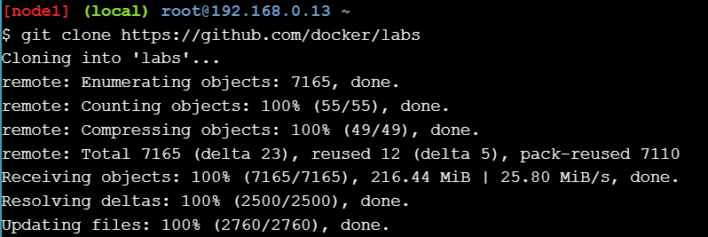
2. Cambiar al labs/security/seccompdirectorio.
    cd labs/security/seccomp
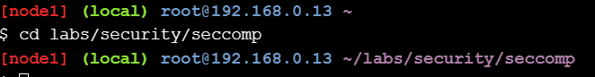

Los pasos restantes de este laboratorio supondrán que está ejecutando comandos desde este labs/security/seccompdirectorio. Esto será importante al hacer referencia a los perfiles seccomp en los distintos docker runcomandos del laboratorio.


### Step 2 - Test a seccomp profile

En este paso, utilizará el deny.jsonperfil seccomp incluido en el repositorio de guías de laboratorio. Este perfil tiene una lista blanca de llamadas al sistema vacía, lo que significa que se bloquearán todas las llamadas al sistema. Como parte de la demostración, agregará todas las capacidades y deshabilitará efectivamente apparmor para saber que solo su perfil seccomp está impidiendo las llamadas al sistema.

Utilice el docker runcomando para intentar iniciar un nuevo contenedor con todas las capacidades agregadas, apparmor sin restricciones y el seccomp-profiles/deny.jsonperfil seccomp aplicado.

```docker run --rm -it --cap-add ALL --security-opt apparmor=unconfined --security-opt seccomp=seccomp-profiles/deny.json alpine sh```

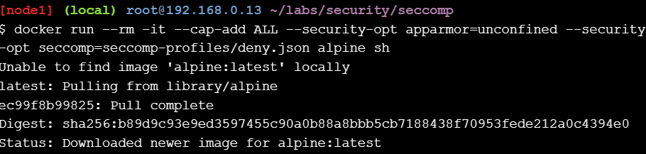
En este escenario, ¡Docker en realidad no tiene suficientes llamadas al sistema para iniciar el contenedor!

1. Inspeccione el contenido del seccomp-profiles/deny.jsonperfil.
    ```cat seccomp-profiles/deny.json```
    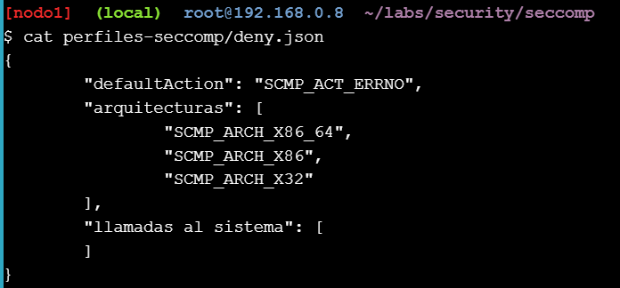
    Tenga en cuenta que no hay llamadas al sistema en la lista blanca. Esto significa que no se permitirán llamadas al sistema desde contenedores iniciados con este perfil.

En este paso, eliminaste las interferencias de las capacidades y de la protección de aplicaciones , y comenzaste un nuevo contenedor con un perfil seccomp que no tenía llamadas al sistema en su lista blanca. Observaste cómo esto impidió todas las llamadas al sistema desde dentro del contenedor o permitió que se iniciara en primer lugar.

### Step 3 - Run a container with no seccomp profile

A menos que especifique un perfil diferente, Docker aplicará el perfil seccomp predeterminado a todos los contenedores nuevos. En este paso, verá cómo forzar la ejecución de un contenedor nuevo sin un perfil seccomp.

1. Inicie un nuevo contenedor con la --security-opt seccomp=unconfinedbandera para que no se le aplique ningún perfil seccomp.

    ```docker run --rm -it --security-opt seccomp=unconfined debian:jessie sh```

    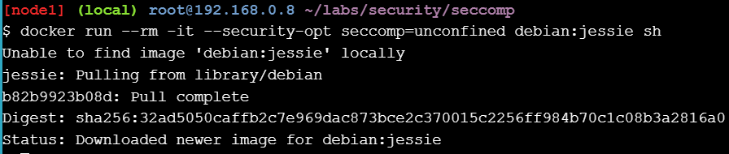

2. Desde la terminal del contenedor, ejecute un whoamicomando para confirmar que el contenedor funciona y puede realizar llamadas al sistema al host Docker.
    ```
    whoami
    ```

    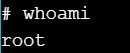

3. Para demostrar que no estamos ejecutando el perfil seccomp predeterminado, intente ejecutar un unsharecomando que ejecuta un proceso de shell en un nuevo espacio de nombres:
    ```
    unshare --map-root-user --user
    whoami
    ```
    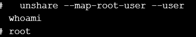

4. Salga del nuevo shell y del contenedor.
    ```
    exit
    exit
    ```
    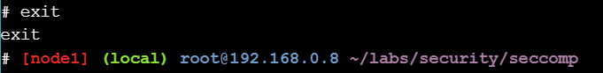

5. Ejecute el siguiente stracecomando desde su host Docker para ver una lista de las llamadas al sistema utilizadas por el whoamiprograma.

    Su host Docker necesitará tener el stracepaquete instalado.
    ```
    apk add --update strace

    strace -c -f -S name whoami 2>&1 1>/dev/null | tail -n +3 | head -n -2 | awk '{print $(NF)}'
    ```
    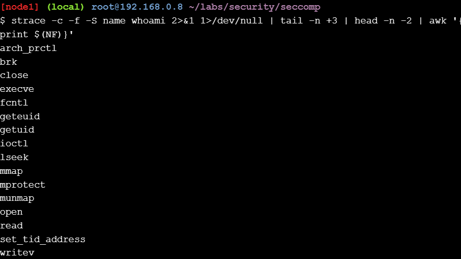

También puede ejecutar el siguiente comando más simple y obtener una salida más detallada.

```strace whoami```

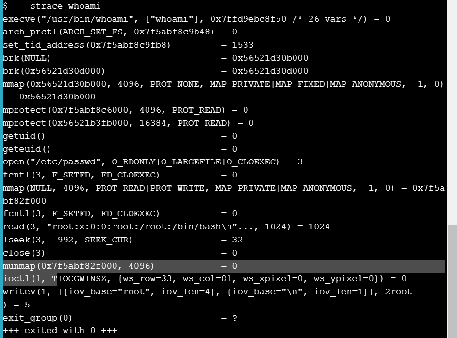

Puedes sustituir whoami por cualquier otro programa.

En este paso, inició un nuevo contenedor sin perfil seccomp y verificó que el whoamiprograma pudiera ejecutarse. También utilizó el straceprograma para enumerar las llamadas al sistema realizadas por una ejecución particular del whoamiprograma.

### Step 4 - Selectively remove syscalls

En este paso, verá cómo aplicar cambios al default.jsonperfil puede ser una buena forma de ajustar qué llamadas al sistema están disponibles para los contenedores.

El default-no-chmod.jsonperfil es una modificación del default.jsonperfil con las llamadas al sistema chmod(), fchmod(), y chmodat()eliminadas de su lista blanca.

1. Inicie un nuevo contenedor con el default-no-chmod.jsonperfil e intente ejecutar el chmod 777 / -vcomando.

    ```docker run --rm -it --security-opt seccomp=./seccomp-profiles/default-no-chmod.json alpine sh```

    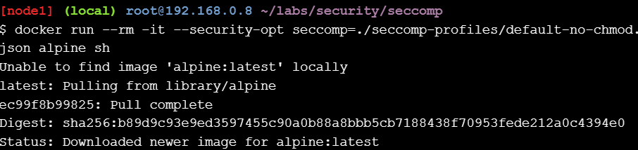

    y luego desde el interior del contenedor:

     ```chmod 777 / -v ```
    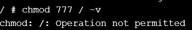

El comando falla porque chmod 777 / -vutiliza algunas de las llamadas al sistema chmod(), fchmod()y chmodat()que se han eliminado de la lista blanca del default-no-chmod.jsonperfil.

1. Salir del contenedor.

    ```exit```

    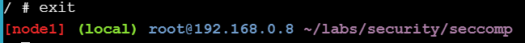
2. Inicie otro contenedor nuevo con el default.jsonperfil y ejecute el mismo chmod 777 / -v.

    ```docker run --rm -it --security-opt seccomp=./seccomp-profiles/default.json alpine sh```

    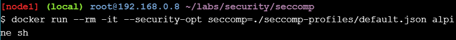
y luego desde el interior del contenedor:

```chmod 777 / -v```
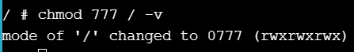
El comando tiene éxito esta vez porque el default.jsonperfil tiene las llamadas al sistema chmod(), fchmod(), y chmodatincluidas en su lista blanca.
1. Salir del contenedor.
    ```exit```
    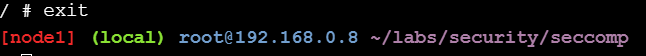
2. Verifique ambos perfiles para detectar la presencia de las llamadas al sistema chmod(), fchmod()y chmodat().

    Asegúrese de ejecutar estos comandos desde la línea de comandos de su Docker Host y no desde dentro del contenedor creado en el paso anterior.

    ```cat ./seccomp-profiles/default.json | grep chmod```

    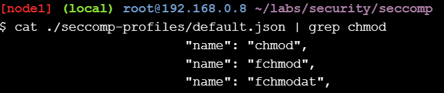

    ```cat ./seccomp-profiles/default-no-chmod.json | grep chmod```
    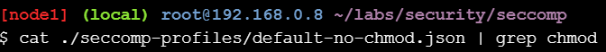

El resultado anterior muestra que el default-no-chmod.jsonperfil no contiene llamadas al sistema relacionadas con chmod en la lista blanca.

En este paso, vio cómo eliminar llamadas al sistema específicas del default.jsonperfil puede ser una forma poderosa de comenzar a ajustar la seguridad de sus contenedores.

### Step 5 - Write a seccomp profile

La regla solo coincide si todos los argumentos coinciden. Agregue varias reglas para lograr el efecto de un OR.

stracese puede utilizar para obtener una lista de todas las llamadas al sistema realizadas por un programa. Es un muy buen punto de partida para escribir políticas de seccomp. Aquí hay un ejemplo de cómo podemos enumerar todas las llamadas al sistema realizadas por ls:

```strace -c -f -S name ls 2>&1 1>/dev/null | tail -n +3 | head -n -2 | awk '{print $(NF)}'```

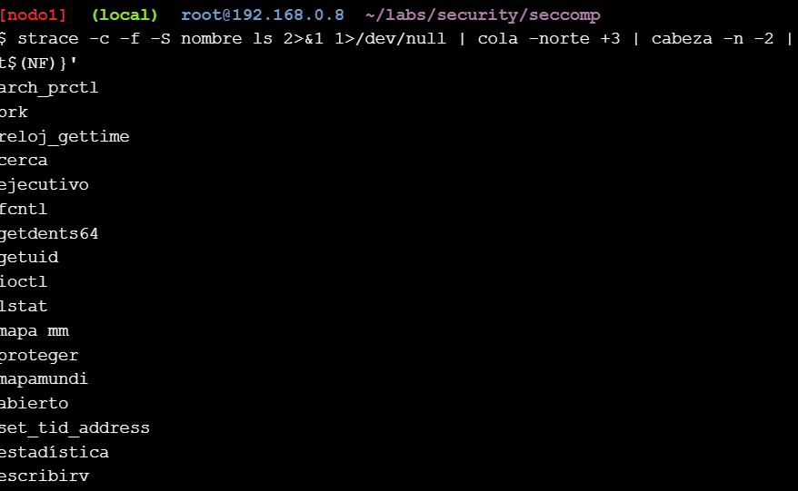

El resultado anterior muestra las llamadas al sistema que deberán habilitarse para que un contenedor que ejecute el lsprograma funcione, además de las llamadas al sistema necesarias para iniciar un contenedor.

En este paso, aprendió el formato y la sintaxis de los perfiles seccomp de Docker. También aprendió el orden de preferencia de las acciones, así como también cómo determinar las llamadas al sistema que necesita un programa individual.

